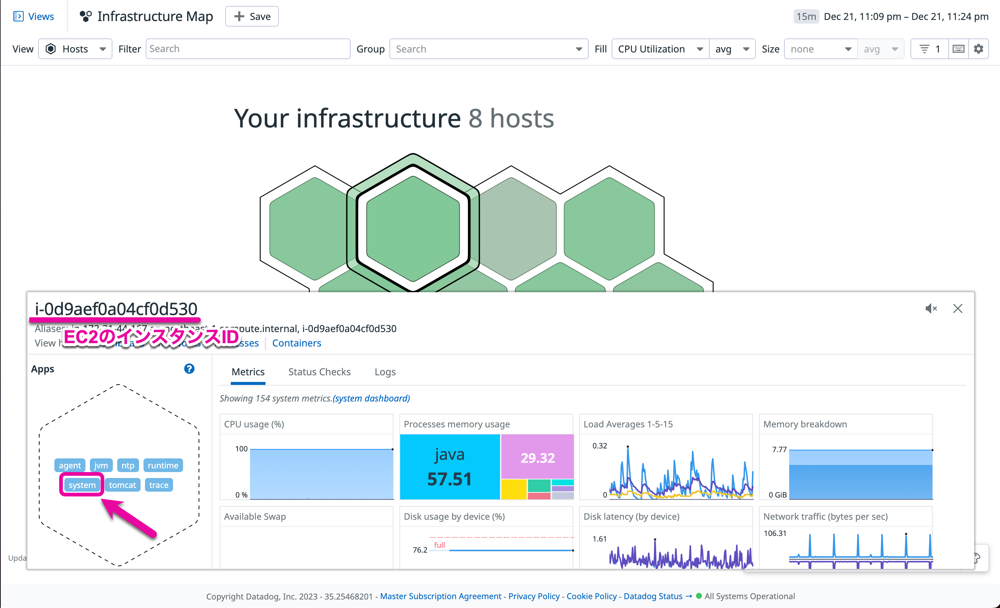
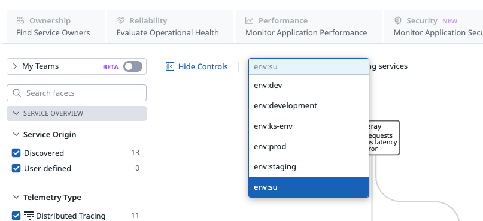
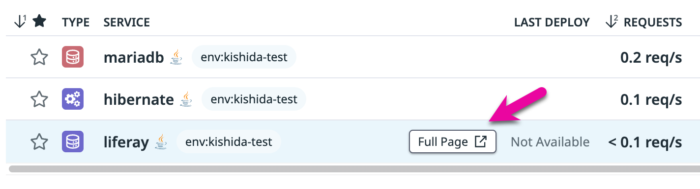
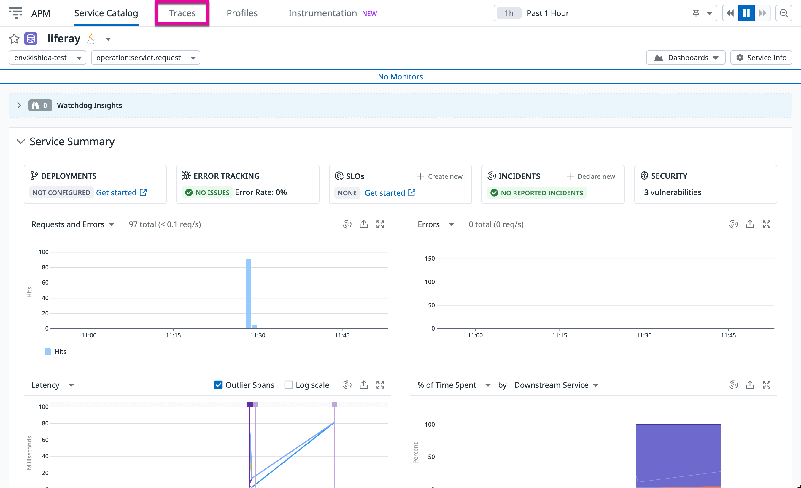

# Datadogの導入

DatadogエージェントをEC2インスタンスへインストールし、Datadogで収集された各種インフラメトリクスのデータを確認します。

## Datadog Agentの導入

【Document】 [https://docs.datadoghq.com/ja/agent/basic_agent_usage/deb/?tab=agentv6v7](https://docs.datadoghq.com/ja/agent/basic_agent_usage/deb/?tab=agentv6v7)

1. Datadogにログインし左のメニューから\[Integrations\]→\[[Agent](https://app.datadoghq.com/account/settings#agent)\]を選択
2. 画面上部のタブが\[Agent\]となっていることを確認し、Agent選択一覧から\[[Debian](https://app.datadoghq.com/account/settings#agent/debian)\] を選択
3. \[Select API Key\]を押下し、 \[+Create New\]で新しいAPI-Keyを追加（例: Name: key-自分の名前や愛称等）し、\[Save\]で保存
4. 新しく作成されたAPI-Keyを選んで\[Use API Key\]を選択
5. Enable APM Instrumentationのトグルをオンにする
6. インストールコマンドのコピー、\[Use our easy one-step install.\]からインストール用コマンドラインをコピー

7. Lab0でSSH接続したターミナルを開き、EC2インスタンスに5でコピーしたコマンドをペーストし実行
8. 以下のように出力されればエージェントのインストールは完了です。
```
* Starting the Datadog Agent...

  Your Datadog Agent is running and functioning properly.
  It will continue to run in the background and submit metrics to Datadog.
  If you ever want to stop the Datadog Agent, run:

      sudo systemctl stop datadog-agent

  And to run it again run:

      sudo systemctl start datadog-agent
```

### ［参考］Datadog Agentの起動、停止、再起動の方法
| 説明  | コマンド |
| --- | --- |
| Agent をサービスとして起動 | sudo service datadog-agent start |
| サービスとして実行中の Agent の停止 | sudo service datadog-agent stop |
| サービスとして実行中の Agent の再起動 | sudo service datadog-agent restart |
| Agent サービスのステータス | sudo service datadog-agent status |
| 実行中の Agent のステータスページ | sudo datadog-agent status |
| フレアの送信 | sudo datadog-agent flare |
| コマンドの使用方法の表示 | sudo datadog-agent --help |
| チェックの実行 | sudo -u dd-agent -- datadog-agent check &lt;CHECK_NAME&gt; |

## Datadogでのメトリクスおよびホストの確認

エージェントをインストールしたホストの各種インフラメトリクスを確認します。
> **エージェントインストールしたホストの情報反映には時間がかかります**

1. Datadog画面に戻り左の\[Infrastructure\]→\[Host Map\]を選択
    - ホストマップ上で自分のEC2ホストが表示されることを確認してください。何も表示されない場合は、時間をおいてリロードをしてください
    - 自分のホスト名はAWS EC2のインスタンスID（例： i-xxxxxxx）です
2. 表示されたホスト（六角形の）をクリック、クリックするとホストの詳細ペインが表示されます
    1. ホストの詳細ペインの「Apps」ヘッダーの下にそのホストからのメトリクスをレポートするインテグレーションがリストされていることを確認できます。<br>
    この段階では、「agent」、「ntp」、「system」が表示されています。
    2. インテグレーションの名前をクリックすると、そのインテグレーションのメトリクスがコンパクトなダッシュボードに表示されます。「system」をクリックし、CPU 使用率、メモリ使用量、ディスクのレイテンシーなどのシステムメトリクスが取得されていることを確認します。



## APMの確認

エージェントインストールと同時にAPMの設定も完了しています。
ここではAPM上にデータが表示されていることを確認します。

### トランザクションの生成

1. 以下のコマンドでサービスを再起動します
```
sudo /opt/bitnami/ctlscript.sh restart
```

2. ChromeなどのWebブラウザを開き http://x.x.x.x にアクセスします。x.x.x.xにはEC2インスタンスのパブリックIPを入力、またhttpsではなく、httpで接続します。

### UI確認（Service Catalog）

Datadogコンソールの左メニューからAPM > Service Catalogを選択します。



任意のサービスの行にある`Full Page`をクリック



### UI確認（Service Overview）
リクエスト数やレイテンシーが表示されています。



### UI確認（Traces）
上記のメニュから`Traces`を選択します。

トレースの一覧が表示されますので、どれか1つをクリックして中身を確認してください。


以上でLab1は終了です。
[Lab2](../Lab2)を進めてください。
