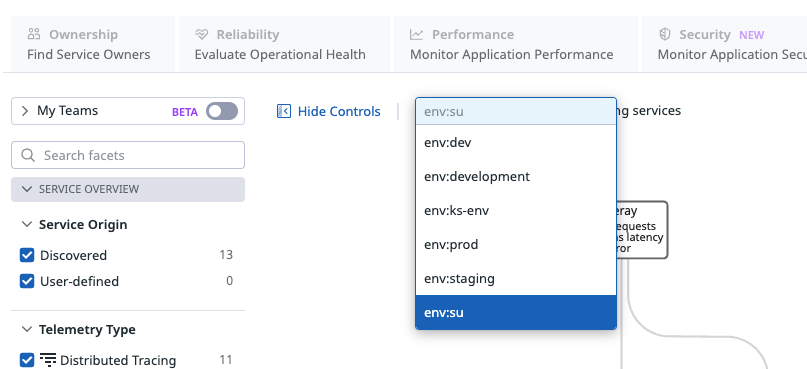
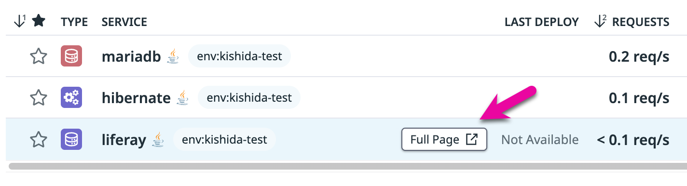
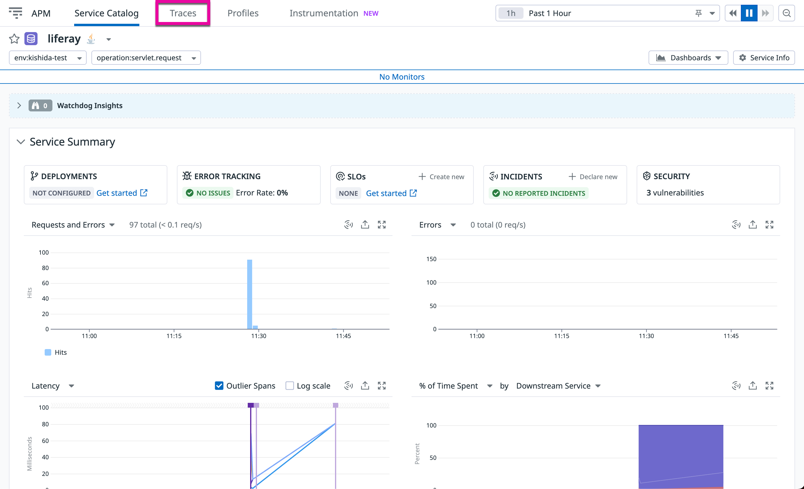

# APMの設定

このセクションではAPMを有効化し、アプリケーションのトレースを取得します。
APMの概要、公式ドキュメントは以下をご参照ください。
ドキュメント：[APM](https://docs.datadoghq.com/ja/tracing/#pagetitle)

## トレーサーのダウンロード

ドキュメント：[トレーサーのダウンロード](https://docs.datadoghq.com/ja/tracing/trace_collection/dd_libraries/java/?tab=%E3%81%9D%E3%81%AE%E4%BB%96%E3%81%AE%E7%92%B0%E5%A2%83#%E3%82%A2%E3%83%97%E3%83%AA%E3%82%B1%E3%83%BC%E3%82%B7%E3%83%A7%E3%83%B3%E3%81%AE%E3%82%A4%E3%83%B3%E3%82%B9%E3%83%84%E3%83%AB%E3%83%A1%E3%83%B3%E3%83%86%E3%83%BC%E3%82%B7%E3%83%A7%E3%83%B3)

トレーサーを配置するディレクトリに移動します。
```
cd /opt/bitnami/tomcat/bin
```
> ※今回は上記に配置しますが置き場所に指定はありません。システムごとの設計に合わせた場所に置いてください。

トレーサーをダウンロードします。
```
sudo wget -O dd-java-agent.jar https://dtdg.co/latest-java-tracer
```

## トレーサーの起動設定
ドキュメント：[トレーサーの起動設定](https://docs.datadoghq.com/ja/tracing/trace_collection/dd_libraries/java/?tab=%E3%81%9D%E3%81%AE%E4%BB%96%E3%81%AE%E7%92%B0%E5%A2%83#java-%E3%83%88%E3%83%AC%E3%83%BC%E3%82%B5%E3%83%BC%E3%82%92-jvm-%E3%81%AB%E8%BF%BD%E5%8A%A0%E3%81%99%E3%82%8B)

利用するフレームワークに応じてマニュアルのタブを切り替えて確認してください。
今回はTomcatを利用したアプリケーションを利用します。

前セクションで移動した`/opt/bitnami/tomcat/bin`で以下のコマンドを実行してファイルを編集します。
```
sudo vi setenv.sh
```
Tomcatインテグレーションの手順で追加した以下の項目が末尾にあることを確認してください。
```
export CATALINA_OPTS="-Dcom.sun.management.jmxremote=true -Dcom.sun.management.jmxremote.port=9012 -Dcom.sun.management.jmxremote.authenticate=false -Dcom.sun.management.jmxremote.ssl=false -Dcom.sun.management.jmxremote.host=127.0.0.1"
```
以下のオプションを追記します。**Ddd.envの情報で各ご参加者様の環境を論理的に分割致します。（ご自分のイニシャルや愛称）には他のご参加者様と重複しない文字列を入力して下さい。**
```
-javaagent:/opt/bitnami/tomcat/bin/dd-java-agent.jar -Ddd.service=liferay -Ddd.env=（ご自分のイニシャルや愛称）
```

| オプション | 意味 |
| ----|----|
| -javaagent:/opt/bitnami/tomcat/bin/dd-java-agent.jar| トレーサーの起動設定 |
| -Ddd.service=liferay | Datadogのserviceタグを定義 |
| -Ddd.env=（ご自分のイニシャルや愛称） | Datadogのenvタグを定義 |

追記後は以下のような記述になります。
> `”`（ダブルクォーテーション）の位置に注意してください。
```
export CATALINA_OPTS="-Dcom.sun.management.jmxremote=true -Dcom.sun.management.jmxremote.port=9012 -Dcom.sun.management.jmxremote.authenticate=false -Dcom.sun.management.jmxremote.ssl=false -Dcom.sun.management.jmxremote.host=127.0.0.1 -javaagent:/opt/bitnami/tomcat/bin/dd-java-agent.jar -Ddd.profiling.enabled=true -Ddd.service=liferay -Ddd.env=my-name"
```

## Tomcatの再起動
起動設定を適用するためにTomcatを再起動します。
```
cd /opt/bitnami
```
```
sudo sh ./ctlscript.sh restart tomcat
```
Tomcatの起動状態を確認します。
```
sudo sh ./ctlscript.sh status
```
正常起動していることを確認します。
```
sudo sh ./ctlscript.sh status
apache already running
elasticsearch already running
mariadb already running
tomcat already running
```
## APMの動作確認

### Agentの状態確認
DatadogエージェントでAPMデータが収集されていることを確認します。
```
sudo datadog-agent status
```
APM Agentのセクションが以下のようになっていれば収集が成功しています。
```
=========
APM Agent
=========
  Status: Running
  Pid: 7907
  Uptime: 445103 seconds
  Mem alloc: 13,787,976 bytes
  Hostname: i-0833dcd1bfe204735
  Receiver: localhost:8126
  Endpoints:
    https://trace.agent.datadoghq.com

  Receiver (previous minute)
  ==========================
    From java 11.0.18 (OpenJDK 64-Bit Server VM), client 1.11.2~4e957fc01e
      Traces received: 216 (113,967 bytes)
      Spans received: 221
```
### Liferayでの操作
各種テレメトリをDatadogに送信するために、Liferayにアクセスしスパンを生成します。

今回EC2インスタンス上に展開されているLiferayはWebポータルやWebコンテンツ管理、ドキュメント管理などを行うオープンソースのWebサービスです。ログインを行い、操作を試してみます。

1. SSHターミナル上で以下コマンドを実行します。
```
cat ~/bitnami_credentials
```
以下のような出力が現れるので、中央部に表示されるパスワードをメモします。
```
Welcome to the Liferay packaged by Bitnami

******************************************************************************
The default username and password is 'user@liferay.com' and 'xxxxxxxxxxxxx'.
******************************************************************************

You can also use this password to access the databases and any other component the stack includes.

Please refer to https://docs.bitnami.com/ for more details.
```

2. ChromeなどのWebブラウザを開き http://x.x.x.x にアクセスします。x.x.x.xにはEC2インスタンスのパブリックIPを入力、またhttpsではなく、httpで接続します。
3. 画面右上の"Sign in"をクリックし、 以下のように入力して"Sign in"ボタンをクリックします。
```
Email Address: user@liferay.com  
Password: 上記でメモした内容  
```
3. 利用規約（Terms of Use）を確認し\[I Agree\]をクリックします。
4. Change Passwordで新しいパスワードを入力（2回）
5. パスワードリカバリを登録（Password Recovery Question and Answer）
6. 左上のHome横の□をクリックしメニューを表示
7. \[Content&Data\]のWikiなどの追加を操作


## Datadog UIでの確認

### Service Catalog

Datadogコンソールの左メニューからAPM > Service Catalogを選択します。
画面中央部のenv選択のドロップダウンメニューより、設定したenv:（ご自分のイニシャルや愛称）を選択します。



liferayの行にある`Full Page`をクリック



### Service Overview
リクエスト数やレイテンシーが表示されています。



### Traces
上記のメニュから`Traces`を選択します。

トレースの一覧が表示されますので、どれか1つをクリックして中身を確認してください。

以上でLab3は終了です。
[Lab4](../Lab4)を進めてください。
