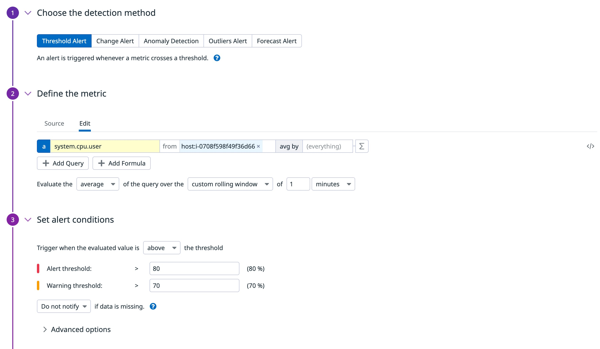
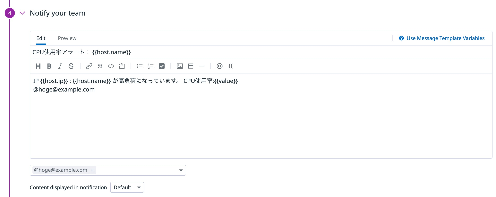

# アラート設定

取得したメトリクスをもとにアラートを設定します。Datadogではアラート設定のことを「モニター（Monitor）」と呼びます。

ドキュメント：[モニター](https://docs.datadoghq.com/ja/monitors/)


## CPU使用率によるモニターの設定
今回は「CPU使用率」というメトリクスを使ってモニターを作成します。

[Monitors]→ [New Monitor]→ [Metric] ページに移動します。

以下のように設定します。

| 設定場所 | 値 |
| ----|----|
| Choose the detection method | Threshold Alert（しきい値アラート）|
| Define the metric | `system.cpu.user` （CPUがUserのプロセスを実行するのに費やした時間の割合）<br> fromには 自身のインスタンスを選択（host:i-00xxxxxxxxxxx） <br> - Evaluate the `average` of the query over the `custom rolling window` of `1` `minutes` （1分間の平均のCPU使用率を計測）|
| Set alert conditions | 70%を超えた場合はWarningを、80%を超えた場合はAlertとなるよう設定 <br> - Trigger when the evaluated value is `above` the threshold <br> - Alert threshold: > 80 <br> - Warning Threshold > 70 |
| Say what's happening | 発砲時のメッセージを設定 <br> - モニター名：`CPU使用率アラート： {{host.name}}` <br> - メッセージ： ```IP {{host.ip}} :  {{host.name}} が高負荷になっています。 CPU使用率:{{value}} ``` |
| Notify your team | 通知先として自分のメールアドレスを設定 <br> 例： `@hoge@example.com`（メールアドレスの前に`@`をつける）|





ページの下部の[Create]をクリックして保存します。

## サーバに負荷をかける
OSSのstressツールを使用してアプリケーションに負荷をかけます。

EC2にstressツールのインストールします。
```
sudo apt-get install stress
```
stressコマンドで、サーバのCPU（ユーザー）に負荷をかけます。
```
stress -c 2
```
設定したメールアドレスにアラートメールが来ていることを確認します。

メールが確認できたらStressツールを止めます（Ctrl+c）。


以上でLab4は終了です。
[Lab5](../Lab5)を進めてください。
