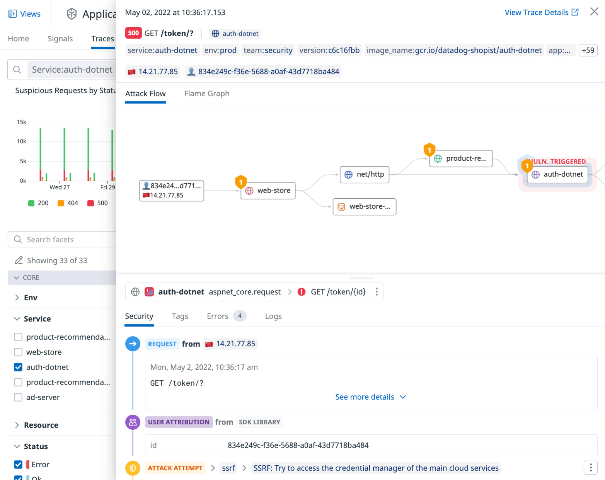
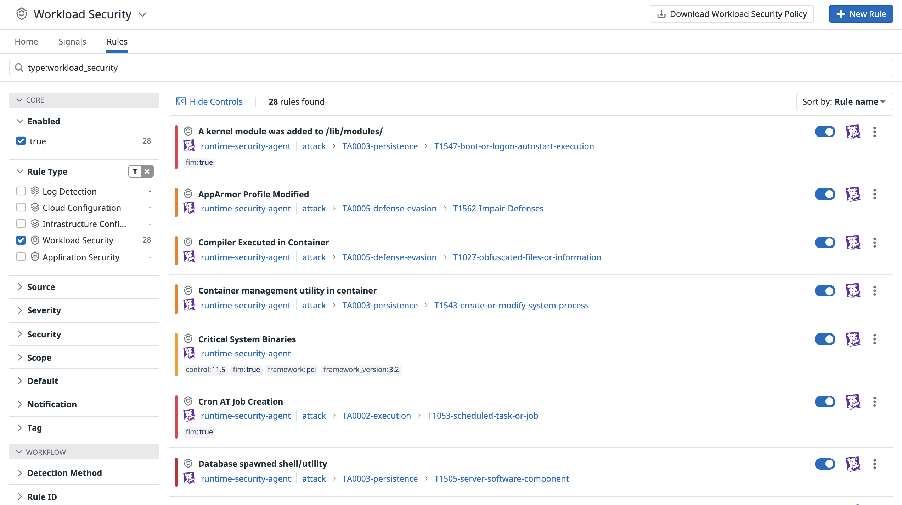

# ASM Learning Center

Status: In Progress
Date Created: March 21, 2024 2:23 PM

# イントロダクション

Datadogセキュリティには次のものが含まれます：

このコースでは、アプリケーションセキュリティ管理とクラウドワークロードセキュリティからのセキュリティシグナルについて説明します。

- アプリケーションセキュリティ管理（ASM）
    - Datadogのトレースライブラリを活用して、コードレベルの脆弱性の可視化とアプリケーションへの攻撃を、検知およびブロックできます。

- クラウドワークロードセキュリティ（CWS）
    - Datadog Agentをホスト型IDSとして用いることができます。これにより、Agentが稼働しているホストにおける、ファイル操作、ネットワークイベント、およびプロセスのアクティビティを監視して脅威を検出します。

---

# **Datadogでのアプリケーションセキュリティ管理（ASM）の仕組み**

Datadog ASMは、アプリケーションへの攻撃や、悪意のある行為を可視化します。さらに、ランタイムでアプリケーションが使用する脆弱なライブラリや依存関係など、アプリケーションに残存する脆弱性を検出します。

Datadog ASMは、Datadogのアプリケーションパフォーマンスモニタリング（APM）で使用されているトレースライブラリと同じものを利用します。APMは、これらのライブラリを使用して、各アプリケーションへのリクエストに関する[トレース(Trace)](https://docs.datadoghq.com/tracing/glossary/#trace)を記録します。一方、ASMは、トレースライブラリを使用してトラフィックを監視し、攻撃試行を検知します。

ASMは、既知の攻撃パターンに対するシグネチャーマッチング方式の検知ルールを定義し、攻撃を検知します。Datadogのリサーチャーにより、新規の攻撃パターンが特定されるたびにこれらのルールは更新されます（独自のユースケースをカバーするためにカスタムルールを作成することもできます）。ルールがトリガーされると、**セキュリティシグナル(Security Signals)** が作成されます。これらのシグナルは、個々の攻撃試行を1個ずつ評価してアラートを上げるのではなく、意味のある脅威を特定するためのものです。これは、不必要なアラートが頻繁に発生することを防ぐ工夫です。



---

# **Datadogでのクラウドワークロードセキュリティ(CWS)の仕組み**

Datadog Cloud Workload Security（CWS）は、AWS EC2インスタンス、Dockerコンテナ、およびKubernetesクラスタノードなどのワークロードでのリアルタイムの脅威を検索します。Datadogプラットフォームの一部として、このリアルタイムの脅威検出をメトリクス、ログ、トレース、およびその他のテレメトリと組み合わせて、ワークロードへの潜在的な攻撃に関するコンテキストを把握することができます。

CWSは、リアルタイムの監視機能を提供するためにDatadogエージェントを使用しています。具体的には、CWSは以下の4種類の監視を行うためにDatadogエージェントを活用しています：

- **プロセス実行監視**：ホストまたはコンテナでの悪意のある活動をリアルタイムで監視するためのプロセス実行の監視。
- **ファイル整合性監視**：ホストまたはコンテナ上の主要なファイルとディレクトリの変更をリアルタイムで監視するためのファイル整合性の監視。
- **DNSアクティビティ監視**：ホストおよびコンテナ上のネットワークトラフィックをリアルタイムで監視し、悪意のある活動を監視します。
- **カーネルアクティビティ監視**：プロセスハイジャック、コンテナの脱出などのカーネルレベルの攻撃をリアルタイムで監視するためのカーネルアクティビティの監視。

ワークロードセキュリティはDatadogエージェントを使用しており、環境を監視するためにDatadogを既に使用している場合（サポートされているバージョンとプラットフォーム内）、CWSに追加のリソースをプロビジョニングしたり、新しいエージェントを導入する必要はありません。Datadogエージェントをまだ[セットアップ](https://docs.datadoghq.com/agent/)していない場合は、サポートされているオペレーティングシステムにエージェントを設定することから始めてください。




---

# **Lab: アプリケーションセキュリティモニタリングでのアプリケーション攻撃の検出**

## イントロダクション

ラボを開始するには、Datadog Learnアカウントで[Datadog](https://app.datadoghq.com/account/login/)にログインしていることを確認してください。アカウントの資格情報は、左側のターミナルで`creds`を実行して表示できます。

最初に使用するアプリケーションは**NodeGoat**と呼ばれます。これはセキュリティの脆弱性を意図的に含めたNode.jsアプリケーションです。NodeGoatはDockerで構築および実行されます。

# ステップ1: Datadogエージェントのインストール

DatadogでNodeGoatアプリケーションをモニタリングできるようにするには、まずDocker Composeを使用したイメージでエージェントを設定する必要があります。具体的には、Docker Composeファイルで環境変数とラベルを使用してエージェントコンテナを構成します。

## Docker Composeの設定

1. IDEで、`nodegoat`ディレクトリの下にある`docker-compose.yml`を開きます。
    - `nodegoat`およびデータベースである`mongo`の2つのセクションが表示されるはずです。
    - YAMLでは、空白は重要ですので、コードブロックをコピーする際には、インデントレベルを正確に複製してください。
2. 次に、以下のブロックを`docker-compose.yml`ファイルに挿入してDatadogエージェントを追加します。`datadog-agent:`の行は、ファイル内の`nodegoat:`と同じインデントレベルにする必要があります。
    
    ```
    
      datadog-agent:
        image: datadog/agent:7.43.1
        environment:
          - DD_API_KEY
          - DD_APM_ENABLED=true
          - DD_APM_NON_LOCAL_TRAFFIC=true
          - DD_LOGS_ENABLED=true
          - DD_LOGS_CONFIG_CONTAINER_COLLECT_ALL=true
        ports:
          - "8126:8126/tcp"
        volumes:
          - /var/run/docker.sock:/var/run/docker.sock
          - /proc/:/host/proc/:ro
          - /sys/fs/cgroup:/host/sys/fs/cgroup:ro
          - /var/lib/docker/containers:/var/lib/docker/containers:ro
    
    ```
    
    詳細を見てみましょう：

   　　　- `image: 'datadog/agent:7.43.1'`：指定されたDatadog Agent Dockerイメージをコンテナで使用することを示します。
   　　　- `environment`ブロックは、エージェントコンテナ内の指定された環境変数を設定します：
      　　　- `DD_API_KEY`：これは、エージェントがメトリクスとイベントをDatadogに送信するために必要です。これはホスト環境で設定されており、ターミナルで`env |grep DD_API_KEY`を実行すると確認できます。`environment`セクションで値が設定されていないため、Docker Composeはホストの環境変数の値を使用します。
      　　　- `DD_APM_ENABLED`：Datadog Agentがトレースとトレースメトリクスを受け入れるかどうかを指定します。
      　　　- `DD_APM_NON_LOCAL_TRAFFIC`：他のコンテナからトレースをトレースする際に非ローカルトラフィックを許可するかどうかを指定します。
      　　　- `DD_LOGS_ENABLED`：ログを収集するかどうかを指定します。
      　　　- `DD_LOGS_CONFIG_CONTAINER_COLLECT_ALL`：検出されたすべてのコンテナから発生したログを収集するかどうかを指定します。
      　　　- `volumes`ブロックは、ホストファイルシステムのファイルをコンテナにマウントします。この構成は強力ですが、これによりエージェントはDockerデーモンからDocker環境に関するデータまたはホストから発生するプロセスデータをクエリできます。
3. Datadog APMトレースライブラリがDatadogエージェントと通信するために必要ないくつかの環境変数も設定する必要があります。

    `nodegoat`アプリケーションの`environment`セクションに、以下の行を追加してください。
    
    ```
          - DD_AGENT_HOST=datadog-agent
          - DD_TRACE_AGENT_PORT=8126
          - DD_ENV=asm-course
          - DD_SERVICE=nodegoat
          - DD_APPSEC_ENABLED=true
    ```
    
    詳細を見てみましょう:
    
   - `environment` ブロックは、トレースライブラリが使用する指定された環境変数を設定します:
       - `DD_AGENT_HOST`: トレースとトレースメトリックスが送信されるエージェントコンテナ。
       - `DD_TRACE_AGENT_PORT`: トレースデータを送信する際に使用するポート。デフォルトは `8126` です。
       - `DD_ENV`: このコンテナから送信されるデータの環境タグ。
       - `DD_APPSEC_ENABLED`: ASMメトリックスを収集するかどうかを指定します。

4. アプリケーションが正しい順序で起動するようにするために、`depends_on` セクションの `nodegoat` アプリケーションに以下の行を追加してください。
    ```
          - datadog-agent
    ```
    

# ステップ2: Datadogトレーシングライブラリのインストール

Docker Composeファイルの修正が完了したので、次のステップはアプリケーションにDatadogトレースライブラリをインストールすることです。トレースライブラリは、アプリケーションのパフォーマンスメトリクスを収集し、ASMが有効になっている場合、アプリケーションレベルの攻撃に対する可視性を提供するために使用されます。

トレースライブラリがインストールされた後、Datadog ASMを使用するためにアプリケーションのソースコードを編集します。

1. ターミナルで、`/root/lab/nodegoat/` ディレクトリ内で以下の `npm` コマンドを実行してください。
    
    ```
    
    cd /root/lab/nodegoat
    npm install --save dd-trace@3.14.1
    ```
    
2. 次に、アプリケーションコードでAPMトレースライブラリを初期化します。
    IDEで、`nodegoat` ディレクトリの下にある `server.js` を開きます。ファイルの先頭にある `"use strict";` 行の後に以下のコード行を追加してください。これにより、アプリケーションがASM用のトレースライブラリを使用できるようになります。
    
    ```
    const tracer = require('dd-trace').init({appsec: true});
    ```
    

# ステップ3: アプリケーションのビルドと起動

トレースライブラリがインストールされ、ASMを有効にするように設定されたので、アプリケーションをビルドして実行します。アプリケーションはDockerイメージとしてビルドされ、これによりホスト環境から分離されます。

1. ターミナルで、Docker Composeを使用してアプリケーションをビルドして実行します。このコマンドは、`/root/lab/nodegoat` ディレクトリ内の `Dockerfile` テキストファイルに基づいて `nodegoat` イメージをビルドします。
    ```
    docker-compose up -d
    ```
    
2. アプリケーションが正常に起動したことを確認するには、NodeGoatタブをクリックします。コンテナが起動している間、アプリケーションが準備できるまでに1分程度待つ必要があるかもしれません。
3. アプリケーションが起動したら、Datadogアプリで **[Logs > Search](https://app.datadoghq.com/logs)** に移動し、環境からのログを確認します。アプリケーションが起動してからログが表示されるまでに1〜2分かかる場合があります。

    ログイン詳細を取得するには、ターミナルで `creds` コマンドを使用します。

    > 注: 既にDatadogに別のアカウントでログイン済の場合は、一旦、Datadogアカウントからログアウトし、credコマンドで取得したトレーニング用アカウントの認証情報を使用してログインしてください。
    > 

# ステップ4: Niktoスキャナーの使用

次に、サービスが正しくASMに登録されていることを確認するためにトラフィックを生成します。これを行うために、デプロイされたアプリケーションに対して標準的なスキャニングツールであるNiktoを実行します。Niktoのようなスキャニングツールは、攻撃者やセキュリティテスターがアプリケーションの初期の攻撃ポイントを見つけるためによく使用されます。これらは既知の脆弱なアドレスを迅速にスキャンし、可能な攻撃ポイントのリストを返すことができます。


1. ターミナルで、次のコマンドを使用してNiktoを起動します。
    
    ```
    
    nikto -host 127.0.0.1 -port 4000
    ```
    
    
    
2. Niktoの実行が完了するまで待ちます。このプロセスには数分かかります。
3. Datadogアプリで、**[Security > Application Security](https://app.datadoghq.com/security/appsec)** に移動します。
4. ASM Overviewのページで、**What is my application exposed to?** セクションまでスクロールします。**Security Activities**の下では、スキャナーによって生成されたいくつかの疑わしいリクエストが攻撃としてラベル付けされているのを見ることができます。ご覧のとおり、自動スキャナーは非常に短い時間でかなりの量のトラフィックを生成することができます。
5. **Understand your Attack exposure** の隣にある **View Attacks** リンクをクリックして、リクエストのリストを表示します。
6. 開いた **traces** ページで、トレースをクリックすると、要求されたパスやリクエスト元のIPアドレスなどの情報が表示されます。この種の情報は、攻撃者が何を探しているかを判断するのに役立ち、異なる攻撃間の関連を描くのに役立つことがあります。
7. **traces** ページで、**Signals** タブをクリックします。

    **Signal Explorer** ページでは、スキャナートラフィックによって生成された2つのシグナルを見ることができます。スキャナートラフィックに関連する1つの `LOW` シグナルと、良性スキャナーとして指定されたトラフィックに関連する `INFO` シグナルです。
    
    **Attack Tool - Single tool** と呼ばれるシグナルをクリックすると、スキャナーに関する情報、例えばステータスやアプリケーションに受信されたリクエスト（攻撃試行）の数などを見ることができます。特にインターネットに面したサービスでは、スキャナートラフィックはノイズに過ぎないことが多いです。しかし、このようなスキャナートラフィックを通常受けないアプリケーションでは、これらのようなシグナルが意味を持つ場合があります。


# ラボのまとめ

このセクションでは、Docker環境にDatadogエージェントを設定し、Datadogトレースライブラリをインストールし、スキャナーツールのNiktoを使用してトラフィックを生成しました。その後、これらのスキャンから生成されたトラフィックを示すASMによって収集されたシグナルを確認することができました。

次のセクションに進むには、次へボタンをクリックしてください。次のセクションでは、NodeGoatの脆弱性を悪用し、ユーザー属性データを収集する方法を学びます。

---