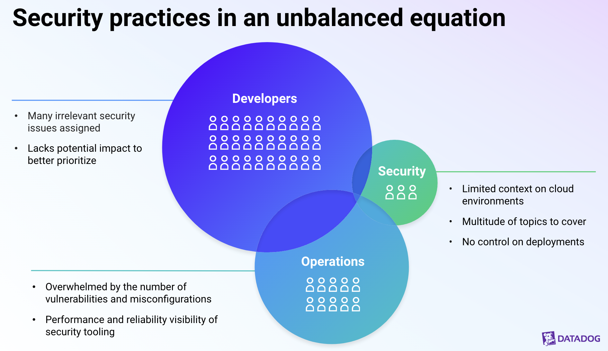
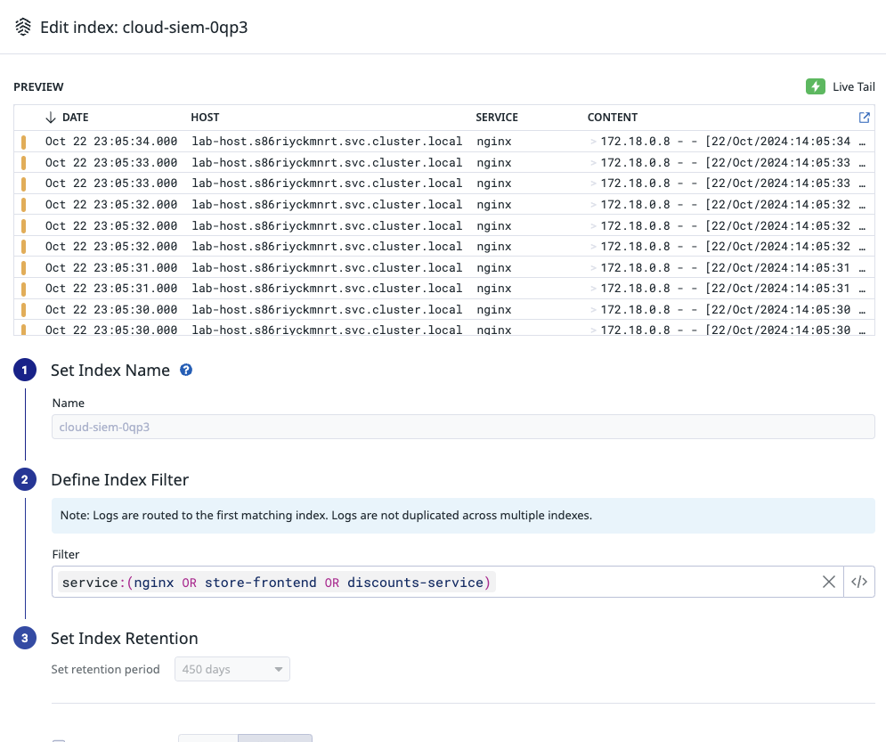

# Introduction to Cloud SIEM {#top}


### コース開始前の準備
- [Datadog Learning Centerのアカウントを登録](https://learn.datadoghq.com/)
- [Introduction to Cloud SIEMコースを登録](https://learn.datadoghq.com/courses/intro-to-cloud-siem)し、別のタブで開きながら手順を進めてください。

### ラボ一覧
- [ラボ１Cloud SIEMの基本を学ぶ](#Lab1)
- [ラボ２追加の検出タイプ](#Lab2)
- [ラボ３攻撃者の経路](#Lab3)

---
# イントロダクション

クラウドネイティブ環境での脅威が増加する中、セキュリティチームは、アプリ開発、運用チームがそうであるように、インフラ、ネットワーク、アプリケーションに対する同等の可視性を必要としています。

同時に、DevOpsエンジニアがサービスのセキュリティを確保する責任を負うにつれて、彼らは脅威を特定するためのモニタリングプラットフォームを必要としています。



Datadogのクラウドセキュリティプラットフォームは、リアルタイムの脅威検出と、クラウドインフラ（アプリケーション、ホスト、コンテナを含む）全体での継続的な設定監査機能を提供します。これをDatadogのオブザーバビリティ・プラットフォームと統合することで、組織はセキュリティおよび運用目標を両立することができます。


Datadogクラウドセキュリティプラットフォームには、[Cloud SIEM](https://docs.datadoghq.com/security_platform/#cloud-siem)、[Cloud Security Management(CSM)](https://docs.datadoghq.com/security/#cloud-security-management)、および[Application Secrity Management (ASM)](https://docs.datadoghq.com/security/application_security/)が含まれています。

このコースでは、Cloud SIEMに焦点を当てます。

[Cloud SIEM](https://docs.datadoghq.com/security/cloud_siem/) により、標的型攻撃、脅威インテリジェンスに含まれるシステムからのネットワーク接続、安全でない設定など、インフラストラクチャおよびアプリケーションへのリアルタイムの脅威を検出することができます。


---

# **Cloud SIEMにおけるログの重要性**

ログは、システムやアプリケーションで何が起こったのか、誰が、何を、どこで、いつ、時にはなぜ起こったのかについての答えを提供します。以下は、ログデータから得られるかもしれない情報のいくつかの例です。

- Who: アクションを取ったユーザー
- What: アクションまたはイベントの名前
- What: アクションが成功したのか失敗したのか
- Where: アクションを取ったユーザーのIPアドレス
- When: UTCのタイムスタンプ
- Why: 失敗の理由（該当する場合）

アプリケーション、ミドルウェア、クラウドプロバイダーのコントロールプレーンまで、すべてがログを生成しています。このため、ログはエンジニアリングチームの脅威検出と対応戦略の中心にあります。

攻撃や脅威を効果的に監視するには、クラウドインフラストラクチャ内の多くのソースからのログを管理するアプローチが必要です。Datadogの[ログ管理](https://docs.datadoghq.com/logs/)は、この目的のために設計されています。

ログはDatadogプラットフォームに多くの形式で取り込まれます。こちらはJSON形式のログの例です：


```json
{
  "requestUri":"/customers/2934ht8/users",
  "customerId":"2934ht8"
}
```

最も一般的なのは、平文のログ行であり、このままの状態では読みにくく、ソートやサマライズが難しくなります。こちらは平文形式の標準ログ行の例です：

```js
Jun 23 02:05:47 a15c20f04822 sshd[71]: Received disconnect from 172.18.0.8 port 40610:11: disconnected by user

```

Datadogでデータをより使いやすくするために、個々のフィールドを取り出すために、平文ログを個々の属性またはJSON形式に分割する必要があります（より具体的には、grokパースを使用します）。Grokパースは、正規表現、エイリアス式、および定義済みのパターンを使用して、半構造化テキストメッセージから属性を抽出します。

> 注意：Datadogは処理パイプラインを使用して個々の属性を抽出できますが、ログ送信の前にできるだけ構造化されたログを持っていることが望ましいです。
> 

---

# **Datadog Cloud SIEM**

Datadog Cloud SIEMは、アプリ開発者、運用チーム、およびセキュリティチームを一つのプラットフォームを通じて統合します。Cloud SIEMを使用することで、これらのチームがアプリケーションやインフラに対するリアルタイムの脅威を検出するのを支援します。これらの脅威には以下が含まれます：

- 標的型攻撃
- 脅威インテリジェンスリストに載っているIPアドレス
- 安全でない設定

検出時には、メール、Slack、Jira、PagerDuty、またはWebhookを通じてチームに通知することができます。また、DevOpsコンテンツ、ビジネスメトリクス、およびセキュリティコンテンツを表示するための単一のダッシュボードも使用できます。

## **Detection Rules**

Cloud SIEMは、異なるソースを横断してログやクラウドの設定を分析するために[検出ルール(Detection Rule)](https://docs.datadoghq.com/security_platform/cloud_siem/log_detection_rules)を使用します。これらのルールは条件ロジックを使用して、特定のセキュリティイベントや設定パラメータを識別します。

特定の期間内にルールが条件に一致するたびに、Datadogはセキュリティシグナル(Security Signals)を生成します。これらのシグナルは、[Security Signal Explorer](https://docs.datadoghq.com/security_platform/explorer)で相関付けられ、Severityによってトリアージされます。

デフォルトでは、Datadogは数百の[OOTB検出ルール](https://docs.datadoghq.com/security/default_rules/)を提供します。これらのルールは、特定の技術を示す攻撃の試行を直ちに識別するとともに、セキュリティ態勢を改善するために、修正可能な設定不備を検出するようになっています。

OOTBルールは、[MITRE ATT&CK®フレームワーク](https://attack.mitre.org/)に対応しており、脅威や攻撃を識別します。MITRE ATT&CK®フレームワークは、実際の使用事例に基づく攻撃者の戦術と技術の知識ベースです。MITRE ATT&CK®フレームワーク知識ベースは、民間セクター、政府、サイバーセキュリティ製品およびサービスコミュニティでの特定の脅威モデルと方法論の開発の基盤として使用されます。Datadogは、これらのOOTB検出ルールに新たな追加を継続的に開発しており、それらは自動的にあなたのDatadogアカウントにインポートされます。


Datadogは数百のOOTBルールを提供していますが、独自の検出ルールの作成は依然として重要です。新しい検出ルールを作成するには、OOTBルールのいずれかをクローンしてからその設定を変更することが容易にできます。または、特定のユースケースに合わせて新しいカスタムルールを最初から作成することもできます。

Cloud SIEMでは、リアルタイムで取り込んだログを分析する[Log Detection](https://docs.datadoghq.com/security/cloud_siem/log_detection_rules/)ルールを含む、さまざまなタイプの検出ルールを作成することができます。他のルールタイプには、クラウド設定ルール、インフラストラクチャ設定ルール、ワークロードセキュリティルール、アプリケーションセキュリティルール、およびシグナル相関ルールが含まれます。


## **All about Detection Methods**

Cloud SIEMは、さまざまな検出方法をサポートしています。

- **Threshold**。これは最も一般的に使用される方法で、特定の時間枠内で値が「閾値」またはカウントを超えた場合を指します。たとえば、閾値が `>10` の場合、指定されたパラメータの値が10を超えるとセキュリティシグナルがトリガーされます。
- **New value**。この検出方法は、時間範囲内に初めて検出される値を示します。たとえば、国やIPアドレスなどの特定の属性に基づいてトリガーを作成する場合、以前に見られなかった**New value**が検出されるたびにセキュリティシグナルが生成されます。
- **Anomaly**。この方法は、時系列的な基準からの逸脱を検出するために使用されます。たとえば、異常検出方法を使用するルールは、異常な数のS3バケットがアクセスされたときを検出できます。
- **Impossible travel**。この検出方法は、単一のユーザーが合理的な移動であるには速すぎるほど迅速にIPアドレスのGeo情報を変更する場合に適用され、本質的に攻撃者の行動を示します。

最良のルールは不必要にノイズを発生させず、注意が必要な問題が発生したときにのみトリガーされるものです。これらを念頭に置きながら、新しい検出ルールを作成するときには、各ユースケースに最も適した検出方法を探すべきです。


## **通知ルール**

また、個々のセキュリティ検出ルールの通知設定を手動で編集することなく、チームに問題を知らせるために[セキュリティ通知ルール (Notification Rules)](https://docs.datadoghq.com/security_platform/notification_rules/)を使用することもできます。通知ルールの通知設定は、複数の検出ルールに適用できます。これらの設定は、Severity、ルールタイプ、ルールタグ、シグナル属性、シグナルタグなどのパラメータに関連づけることができます。

次のラボでは、アプリケーションログを探索し、発生していると疑われる行動を検出するルールを作成します。

---

# **ラボ１: Cloud SIEMの基本を学ぶ** {#Lab1}

このラボでは、シンプルなログクエリを実行し、そのクエリをCloud SIEMでの基本的なアラートに変換する方法を学びます。また、攻撃者による偵察に一般的に使用される攻撃ツールについても学びます。

このラボでは、次のことを行います：

- ログインターフェイスを探索する
- 特定のタイプのアクティビティに対してクエリする方法を理解する
- 検索クエリを保存する
- その検索クエリを使用してカスタム検出ルールを作成する
- 攻撃によってルールがトリガーされたときにセキュリティシグナルが作成されることを確認

注意：このラボは、10分間の非アクティブ状態の後にタイムアウトします。

### はじめに

あなたは対象のアプリで不審な偵察行動があると疑っています。

### ログデータを使用して脅威を特定する

Labのターミナルに表示されているDatadogの認証情報を使用して、このラボのために提供されたDatadogのトライアルアカウントにログインします。（認証情報が表示されていない場合は、ターミナルに`creds`と入力してください。）

[ログ検索](https://app.datadoghq.com/logs)ビューに移動して、Datadogプラットフォームに入ってくるログイベントデータを確認します。

> 注意：「Discover Datadog Log Management」画面が表示された場合は、「Get Started」をクリックし、その後「Start using Log Management」ポップアップウィンドウで「Get Started」をクリックします。ログ検索ビューにリダイレクトされます。
> 


数多くのサービスからのログを識別できるはずです。

ログが流れるにつれて、一部のサービスでエラーの数が多いことに気づくかもしれません。それは、これらのサービスが攻撃行動をシミュレートする一連の自動化ツールによって攻撃されているためです。

以下のクエリを検索フィールドに入力して、`nginx`サービスと任意のエラーに対するリストをフィルタリングします：

```
service:nginx AND -@http.status_code:200
```
`nginx`サービスに対してHTTPステータスコード`404`のログイベントが多いことに気付くでしょう。これは、Webアプリケーション自体に対するディレクトリ・トラバーサル攻撃が原因です。

### ログイベントを探索する

リストのイベントのいずれかをクリックして、ログ詳細のサイドパネルを開きます。上下矢印キーを使用して、リスト内の他のログのログ詳細を表示できます。

ログの詳細では、これらのリクエストが毎回同じIPアドレスから来ており、`gobuster`と呼ばれる奇妙なユーザーエージェントも使用されていることに気付くでしょう。


> 注意：GoBusterは、ウェブサイトの可能なパスの組み合わせを試みるスキャンツールです。[GoBusterのGitHubリポジトリ](https://github.com/OJ/gobuster)を参照してください。
>
### 検索クエリを保存する

ログはCloud SIEMにおけるアラートの基盤です。検索クエリを失わないように、保存された検索クエリを作成することができます。

**ログ**検索フィールドの上にある **+ Save** ボタンをクリックし、以下のように保存された検索に名前を付けてください：

```

[SIEM Testing] Non-Normal Status Codes
```


### Cloud SIEMに慣れる

[Security > Cloud SIEM](https://app.datadoghq.com/security/)に移動します。


**Cloud SIEMを有効にする** を促す画面が表示される場合がありますが、そのまま進めてください。

**Skip**ボタンを選択すると、コンテンツ パックの有効化をバイパスし、ログソースの有効化に進むことができます。 このラボでは、**NGINX**ログソースを有効にしてください。また必要に応じて他のログ ソースを有効にすることもできます。

Cloud SIEMを有効にした後、結果として表示される画面は、あなたの設定を示します（これは[Security > Configuration](https://app.datadoghq.com/security/configuration/siem/setup)を通じてもアクセスできます）。


このページでは、**Index設定** セクションに、修正が必要であるという警告が表示されることに気付くでしょう。NGINXログのようなSIEM対象のログを有効にしたとき、Cloud SIEM用にDatadog内に新しいログインデックスが作成され、それがメインインデックスよりも上に並べ替えられる必要があります。このセクションの指示に従ってインデックスの順序を修正してください。

Cloud SIEM専用のcloud-siem-xxxx名のIndexが自動に作成され、上矢印ボタンをクリックし、一番上に移動します。


Moveボタンをクリックします。


Reorderボタンをクリックしオーダー変更を有効化。


[Logs > Index](https://app.datadoghq.com/logs/pipelines/indexes)の画面で、cloud-siem-xxxxのIndexの行の右にある鉛筆アイコンをクリックし、フィルターを編集します。
Filterの内容を以下に入れ替え、Saveボタンをクリックします。これによって、SIEMルールが適応する全対象のログがフィルタリングされました。
```
service:(nginx OR store-frontend OR discounts-service)
```


Index構成が以下通りになることを確認します。


完了したら、[Security > Cloud SIEM](https://app.datadoghq.com/security/home)に移動してください。


異なるタブ—**Overview**、**Content Packs**、**Signals**、**Detection Rules**、および**Investigator**— を探索して、利用可能なさまざまな機能を確認してください。

Cloud SIEM内の **Detection Rule** タブをクリックしてください。


リストされている検出ルールをスクロールして確認してください。これらはDatadogがCloud SIEMで具備するOOTB検出ルールです。これらを使用することで、使用しているクラウドサービスや製品に対する脅威や攻撃の検出を始めることができます。

良い検出ルールは常に低いFalse Positiveを出すべきであり、実行可能であるべきです。Datadogには多くの有用なOOTB検出ルールが含まれていますが、ビジネスの脅威モデルに関係ないルールもあるかもしれません。ワークフローのための検出ルールを設定するときには、ルールセットを確認し、ビジネスにとって「ノイズが多すぎる」ルールを無効にすることを検討するかもしれません。

ルールはルールの右側にあるトグルを使用して有効または無効にすることができます。Datadogのリサーチャーによって作成されたルールはDatadogの`default`アイコンを表示し、カスタムルールはそのルールを作成したユーザーのアバターを表示します。

### 検出ルールを作成する

今、あなたが以前に気づいた偵察行動（`nginx`サービスに対するHTTPステータスコード404エラーの過剰な量）を警告する検出ルールを作成しようとしています。

画面右上の **+ New Rule** をクリックしてください。

**Detection Rule**を`Threshold`に設定してください。閾値アラームは、値が事前に定義された基準値を超えたときにトリガーされます。

**Query**の横の鉛筆アイコンをクリックして、クエリ名を`non_200_status_codes`に編集してください。

保存した検索に使用した同じクエリを貼り付けてください。


```

service:nginx AND -@http.status_code:200
```


ルールケースを設定してください。これは、アラートが特定の時間枠内で特定の値を超えた場合にアラートをトリガーする数式です。この機能を「スライディングウィンドウ」とも呼びます。時間が経過するにつれて前進するからです。

**Set rule cases**の下で、**Trigger**に`non_200_status_codes > 5`を入力してください。**Name**には`minimal reconnaissance`を入力してください。Severityは`INFO`に設定し、通知フィールドは空のままにしてください。

> 注意：もしより高い数値に対してより高いSeverityを望む場合は、一つのルール内で複数のアラートを作成することができます。
>


**Say what's happening**で、ルール名として以下を入力してください：

```
Possible Directory Enumeration
```

説明は、最初に対応する人が攻撃の発生源とそれについてどう対処すべきかを知るための手順書として機能します。

説明には、以下のメッセージを追加してください：

```

An attempt to perform reconnaissance was detected from the following threat actor {{@network.client.ip}}

The style of attack uses directory enumeration in order to try find administrative pages and insecure directories.  Consider adding this actor to the blocklist.
```
ルールに「タグ」を追加してください。DatadogのOOTBルールは、[MITRE attack framework](https://attack.mitre.org/)にマッピングされています。**Tags**フィールドで、Datadogで提案されている`security:*`、`tactic:*`、`technique:*`タグは、このフレームワークに基づいて脅威や攻撃のタイプをタグ付けするのに役立つことを意図しています。

タグを入力してください：

```
security:attack
```

```
tactic:TA0043-reconnaissance
```

**Save Rule**をクリックしてください。


### 作成したルールとセキュリティシグナルを確認する

[Security > Security Signals](https://app.datadoghq.com/security)に移動します。

作成したばかりの検出ルールに対する1つのセキュリティシグナルがリストにあるはずです。検出ルールがトリガーされてリストにシグナルが表示されるまでに、2～3分待つ必要があるかもしれません。ページを更新する必要があるかもしれません。


シグナルをクリックし、詳細を探索して、そのシグナルについてどのような情報が利用可能かを確認してください。


### まとめ

おめでとうございます！Datadog Cloud SIEMでディレクトリ・トラバーサル攻撃を検出するルールを作成できました。
終了したら、ターミナルに次のコマンドを入力してください：

```
finish
```
ラボの右下隅にある **Check** ボタンをクリックし、結果を待ってください。その後、ラボのフレームの下にある  **Mark Lesson Complete & Continue**  ボタンを選択して、次のセクションに進んでください。

[ページの先頭に戻る](#top)

---
# Cloud SIEM用のログを設定する

Webアプリケーションを運用している場合、顧客が安全にログインできるように、認証フローを実装しているケースは一般的です。例えば、顧客はユーザー名とパスワードのシステムや自分のGoogle認証情報を使用してログインするかもしれませんし、従業員はOAuthベースの認証を会社提供のGoogleアカウントを通じてアプリケーションや内部サービスにログインするために使用するかもしれません。

すべての認証イベントをログに記録し、監視し、分析することは、脅威の特定とコンプライアンスにおいて重要です。異なるソースや異なる環境の認証ログは、異なる形式であることが多く、かつ異なるチームによって管理される場合もあります。また、Google、Okta、Auth0などのサードパーティサービスを使用して実装されていることもあります。これらが複雑になり、すべての認証イベントを効果的に分析を行うことが難しくなります。

アプリケーションの認証ログが十分な情報を含み、かつ、その情報を[標準的で容易に解析可能な形式](https://www.datadoghq.com/blog/logs-standard-attributes/)で提示する認証ログを記録することが重要です。これにより、すべての認証ログに対して複雑な分析を容易に実行できます。

例えば、最も失敗したログイン試行に関連するユーザーやIPアドレスをすぐに特定できます。または、ログインソース（例：ユーザー名 vs Okta vs G Suite）やフロー（例：パスワード vs OAuth vs SAML）のトレンドを追跡したいかもしれません。ログを標準化することにより、コンプライアンス目的で特定のユーザーの認証イベントをすばやく監査または検出することも可能になります。

つまり、認証イベントから有用な方法で情報を抽出するためには、以下を確実に行うことが重要です：

- すべての認証フローからすべてをログに記録する
- 必要な情報をすべて含むログを出力する
- 標準化された、解析可能な形式を使用してログを記録する

# **すべてをログに記録する**

組織が提供するGoogle認証情報を使用して従業員がログインするなど、内部で管理する認証フローからのイベントをログに記録しているケースは一般的です。しかし、たとえば、アプリケーションが顧客に自分のGoogle認証情報を使用してアカウントを作成し、ログインすることを許可している場合、これらを管理していないため、これらのログを収集していない可能性があります。

すべての認証アクティビティを可視化するためには、[アプリケーションレベル](https://docs.datadoghq.com/logs/log_collection/?tab=application#application-log-collection)ですべてのログインフローのイベントをログに記録することを確実に行うべきです。これにより、すべてのイベントをログに記録し、モニタリングのカバレッジにギャップがないことを保証します。また、認証イベントをどのようにログに記録し、どのデータを収集するかをよりコントロールできるようになります。

# **十分な情報を含める**

認証イベントに関するすべてのデータが含まれていなければ、認証ログはほとんど役に立ちません。例えば、以下のエントリーを考えてみてください：

```
2020-01-01 12:00:01 John Doe logged in
```

このログは認証イベントの「誰が」（John Doe）、「何を」（logged in）、そして「いつ」（2020-01-01 12:00:01）を提供します。しかし、「どのように」（例えば、Johnはユーザー名とパスワードを使用したのか、それともGoogleアカウントでログインしたのか？）や「どこで」（例えば、JohnがどのIPアドレスからログインしたか？）といった情報は提供しません。さらに、ログインの成功か失敗かを示しません。これらのデータがなければ、例えば、ログインソースや方法のトレンドを監視したり、潜在的な認証攻撃を特定することはできません。

次に、前述のものから欠けていたすべての情報を含むログを比較してみましょう：

```
2020-01-01 12:00:01 google oauth login success by John Doe from 1.2.3.4
```
このログはイベントに関するより詳細な情報を提供するため、より簡単に複雑な分析を行うのに役立ちます。アプリケーションレベルですべての認証イベントをログに記録することにより、ログがこのレベルの情報を含むようにすることができます。

# **標準的で解析可能な形式でログを記録する**

すべての認証イベントの詳細なログを収集している場合でも、ログイベントが単純な文字列として記述されている場合、必要な情報を解析して検索することは手間です。代わりに、アプリケーションがキーと値の形式でログを記録し、等号("=")をキーと値の間の区切り文字として使用することができます。キーと値の形式では、キーと値のパーサー（例：Datadogの[Grok Parser](https://docs.datadoghq.com/logs/log_configuration/parsing/)）でログを簡単に処理できます。

上記のログを取り上げてみましょう：

```
2020-01-01 12:00:01 google oauth login success by John Doe from 1.2.3.4
```
もし、元のログがKey-Value型であれば、このように見えます：

```
INFO 2020-01-01 12:00:01 usr.id="John Doe" evt.category=authentication evt.name="google oauth" evt.outcome=success network.client.ip=1.2.3.4
```
Datadogは、上のログを以下のJSONとして解析できます：

```json
{
  "usr": {
    "id": "John Doe"
  },
  "evt": {
    "category": "authentication",
    "name": "google oauth",
    "outcome": "success",
  },
  "network": {
    "client": {
      "ip": "1.2.3.4"
    }
  }
}
```

すべての認証ログで同じキーと値の形式を使用することにはいくつかの重要な利点があります。まず、ログデータが分析される際にこれらの属性を使用し、必要な情報を正確に見つけるのに役立ちます。たとえば、どのユーザー（usr.id）が最も多くの失敗したログイン（evt.outcome:failure）を持っているかを簡単に見つけることができます。キーと値の形式を標準化するもう1つの利点は、すべてのログに適用できるカスタム属性を簡単に追加できることです。たとえば、各ログにはreCAPTCHA v3のスコアが含まれており、可能なボットアクティビティを特定することができます。

> 注意: スペースを含む属性値を囲むために引用符を使用してください。これにより、解析しやすい方法で完全な値をキャプチャできます。
> 

どこでも同じフォーマットを使用することに加えて、ログの属性には[標準の命名規則](https://www.datadoghq.com/blog/logs-standard-attributes/)を使用することも重要です。これにより、ソースに関係なく、すべてのログを検索して集計することができます。具体的には、認証ログには、可能な限り以下の[標準属性(Standard attribute)(Standard attribute)](https://docs.datadoghq.com/logs/log_configuration/attributes_naming_convention/)が含まれていることが推奨されます：


- **usr.id**: この属性は、認証をリクエストするユーザーを識別します。`usr.id` の値が、ユーザーをデータベースで識別するために使用する他の一意の識別子ではなく、ユーザー名またはメールアドレスであることを確認してください。ユーザーがデータベースにユーザー名を持っていない場合でも、一意のユーザー名を含める必要があります。一意のユーザー名を使用すると、ログインに失敗したユーザー ID を追跡し、それによって攻撃を検出することができます。
- **evt.category**: この属性を `authentication` に設定すると、認証イベントを簡単に検索して他のイベントログからフィルタリングすることができます。
- **evt.name**: `evt.name` 属性には、認証イベントのソースとメソッドに関する詳細な情報が含まれるべきです。たとえば、SAML を使用するかどうか（`evt.name="saml"`）や、OAuth を使用した Google ログインであるかどうか（`evt.name="google oauth"`）などが含まれます。

    > 注意: `evt.name` 属性は、Datadog が AWS CloudTrail ログなどから属性を再マップする際に使用されます。CloudTrail 認証ログには、ConsoleLogin または SAMLLogin などのイベント名があります。したがって、これらは直接 `authentication` にマッピングされません。Datadog は、より高レベルの属性である `evt.category` を導入し、すべての認証イベントを分類するための分類法を提供しています。
    > 

- **evt.outcome**: これは `success` または `failure` に設定する必要があります。この属性を使用して、アプリケーション全体でログインの失敗パターンを簡単に検索できます。
- **network.client.ip**: これは認証をリクエストするユーザーまたはクライアントの IP アドレスです。この値を記録すると、リクエストの送信元がわかります。

---

# **Cloud SIEMを使用したさまざまなユースケースの調査**

次のラボでは、Cloud SIEMを使用して次の異常な振る舞いを検出を試みます。

- 漏洩したSSHキーの悪用
- 特権アカウントを使用して証跡を隠蔽する
- パスワードスプレー攻撃

# **漏洩したSSHキーの悪用**

図らずも、SSHキーやCloud APIキーを漏洩することがあります。これが発生した場合、通常、漏洩したキーがアクティブに使用されているかどうかを確認する必要があります。このラボでは、そのようなキーの漏洩をシミュレートします。

防御者としての目標は、キーが使用されているかどうかを判断し、使用されている場合はどこで使用されているかを特定することです。また、ローテーションを依頼するチケットを発行する必要があります。

成功したログインは次のようになります:

`Jul 6 09:55:56 289be7948627 [1905]: Accepted publickey for test from 172.18.0.8 port 42134 ssh2: RSA SHA256:D5W2k5sBDmyrQAglU7JxrBW5vnWY7qdze0RkmZIdnW8`

以下のラボで作業しながら、いくつかのサンプル・メッセージを見つけ、それらのメッセージに基づいていくつかのアラートを作成します。

# **特権コマンドの使用によるトラックの隠蔽**

攻撃者は、しばしばリモートでコードを実行したり、パラメーターへの引数を意図的にサニタイズしないことによって環境に入ります（これにより任意のコードが実行される可能性があります）。この段階から、攻撃者の目標はしばしばシステム上の特権ロールにエスカレーションし、環境内でさらに深く移動することです。最も慎重な攻撃者は、徐々にかつ静かに動き、進行中に存在の証拠を消去します。

次のラボでは、Grokパーサーを使用して、「sudo」コマンドを介した特権の使用を抽出します。観察する行動は、攻撃者が「dd」コマンドを使用してディスクにゼロを書き込むことです。攻撃者は、証跡を消すために論理削除したデータが防御者に後で分析されることを防ぐために、未割り当てのディスク領域にゼロまたはランダムな情報を書き込んで上書き削除する場合があります。

# **パスワードスプレー攻撃**

パスワードスプレー攻撃は、攻撃者が既知のユーザー名とパスワードリストを用いて認証突破を試みるときに発生します。同じユーザー名での多数の認証試行・失敗が起きることを想像してみてください。これらの失敗は、多くの場合、さまざまなIPアドレスからも来ます。


[ページの先頭に戻る](#top)

---

# **ラボ２：追加の検出タイプ** {#Lab2}

### イントロダクション

このラボでは、Cloud SIEMのさらに高度な機能を探索します。さまざまな検出タイプを使用することで、アラートに追加のタグを追加し、対応者が使用できるようになります。

**このラボでは、次のことができます:**

- 攻撃者がシステムでとった証跡を隠す行動を理解する
- 特定のタグを持つ検出ルール用の通知ルールを作成する
- **New Value**の検出タイプを使用して検出ルールを作成する
- この検出ルールを使用して、漏洩した資格情報の使用を検出する

環境の準備ができたら、下の**Start**ボタンをクリックしてください。

> 注意: このラボは、10分間のアクティビティがないとタイムアウトします。
> 

### のアクティビティをログエクスプローラーで検索してみてください

[Logs > Search](https://app.datadoghq.com/logs) に移動し、次のクエリを入力してください:

```

publickey
```

ログがアプリケーションから収集され、結果が表示されるまで1〜2分かかる場合があります。1つのサービスが`sshd`アクティビティを持っているはずです。これらのログの詳細を表示します。ログメッセージには、漏洩した資格情報のRSAフィンガープリントが含まれています。

特定のキーを検索するには、検索を絞り込むことができます。


```

publickey AND iH9P29ZnoCAvS0QSxFk1I5IvtHaNtyFua5VgbdGwvB4
```

ログイベントの1つをクリックします。ログデータはCloud SIEM用に処理されていません。後で検出ルールを作成するときに、検出のために**New value**として`Client IP (@network.client.ip)`属性を選択しますが、これらのログではまだ`@network.client.ip`がイベント属性として抽出されていません。


補足に、Cloud SIEMを有効化できたら、全てのIndexに対して、以下例のように自動的にIPを以下のように抽出できます。


今回でラボでは、ログに対してIP抽出処理を例でご体験し、ルールが攻撃をよりよく検出できるようにします。

### ログ構成を調整するためのログパイプラインを作成

[Logs > Configuration](https://app.datadoghq.com/logs/pipelines)に移動し、**New Pipeline**をクリックします。**Filter**に`sshd`を入力します。**Name**に`sshd_extract_ip`を入力します。**Tags**は空白のままにします。**Description**に`sshイベントからIPアドレスを抽出します`と入力します。**Create**をクリックします。


ログデータが受信されると、Datadogが提供するプロセッサを使用して、複数の方法でログを補足および変更できます。

パイプラインリストで、作成したパイプラインを展開して、**Add Processor**をクリックします。


**Select the processor typeロセッサの種類を選択**では、`Grok Parser`を選択します。

**Name the processorプロセッサの名前**には、`ip_extraction`と入力します。

その後、**Parse My logs**をクリックします。Datadogは、標準ログメッセージからJSONに変換できる異なるログパターンを自動的に識別するはずです。

**log samples**フィールドと**Define parsing rules**フィールドがログサンプルとそれぞれのルールで埋められるのが見えます。

自動入力されたルールでは、IPアドレスが抽出され、標準属性(Standard attribute)`@network.client.ip`に配置されます。以下の引用された例では、この属性を持つルールは`autoFilledRule3`です。

> autoFilledRule3 Jul\s+6\s+%{date("HH:mm:ss"):date}\s+%{notSpace:token_1}\s+sshd[%{integer:token_2}]:\s+Accepted\s+publickey\s+for\s+test\s+from\s+%{ipv4:network.client.ip}\s+port\s+%{integer:token_3}\s+ssh2:\s+RSA\s+SHA256:%{notSpace:token_4}
> 

ログメッセージに`publickey`が含まれるログサンプルをクリックしてください。解析されたログの結果が、解析ルールのリストの下に表示されるフィールドに正しくパースされているかを確認します。そうでない場合、下の画像に示されているような結果が表示されます。解析されたログは、解析ルールのフィールドの下に表示され、`publickey`ログサンプルが正しいルール`autoFilledRule3`に一致したのではなく、`autoFilledRule2`に一致したことを示しています。


解析ルールの順序は重要です。ログサンプルが正しいルールで解析されていない場合は、正しいルールを、それが解析されている誤ったルールの上に移動するか、正しいルールをリストの先頭に移動します。下の画像の例では、`autoFilledRule3`ルールを`autoFilledRule2`の上に移動し、`publickey`ログサンプルと同様の形式を持つすべてのログが正しく解析されることを確認します。ルールの下のフィールドに表示される結果が、ログサンプルが正しく一致し、`autoFilledRule3`で解析されたことを示していることがわかります。


**Create**. をクリックします。

[Logs > Search](https://app.datadoghq.com/logs) に移動します。

以下のクエリを使用して検索リストを絞り込みます：

```

publickey AND iH9P29ZnoCAvS0QSxFk1I5IvtHaNtyFua5VgbdGwvB4
```

新しいログイベントのいずれかをクリックします。ログイベントが今回は意図した通りに処理されていることがわかります。イベント属性は自動的に抽出されました。`sshd`のアクティビティのIPアドレスも抽出され、標準属性(Standard attribute)の`@network.client.ip`に配置されます（以下の画像で囲まれています）。


この属性は自動的にUIでファセット化され、**Web Access > Client IP**の**Facets**リストの下に見つけることができます。この属性は、新しい検出ルールを作成するために使用できるようになりました。

### 通知ルール (Notification Rule)の作成

SSHキーが新しいIPアドレスで使用されたときにアラートを受信するための検出ルールを作成する前に、通知ルールを作成するかどうかを決定できます。

[Security > Settings](https://app.datadoghq.com/security/configuration)に移動し、**Notifications**タブを選択します。

**Create your first notification rule**メッセージの下にある**Create New Rule**をクリックします。

**Source Types**で、`Log Detection`を選択します。**Rule Criteria**で、**If an issue has any of these severities**に`High`と`Critical`を入力し、**And contains all of the following tags and attributes**に`env:development`と`service:discounts-service`を入力します。

**Notification Details**の下にある**Then notify**フィールドはそのままにして、**Name**に`High and Critical Severity Discounts Service Threats`を入力します。

**Save and Activate**をクリックします。


### SSHDアクティビティの検出ルールの作成

次に、新しいIPアドレスでSSHキーが使用されたときにアラートを受信するための**New value**の検出ルールを作成します。このルールは、攻撃者のIPアドレスごとに1回だけトリガーされます。**New value**の検出ルールは、環境内のノイズを減らす優れた方法です。

[Security > Cloud SIEM](https://app.datadoghq.com/security)に移動します。

**Detection Rules**タブをクリックします。

画面右上の**+ New Rule**をクリックします。

**Select a rule type**でLog Detectionを選択したままにして、**Detection methods**を`New Value`に設定します。

**Define search queries**の下に、以前のクエリを入力します:


```

publickey AND iH9P29ZnoCAvS0QSxFk1I5IvtHaNtyFua5VgbdGwvB4
```

**New valueの検出** ドロップダウンメニューから、**Client IP (@network.client.ip)** を選択します。


「7日後」の値を「すべての**New value**に対して」に変更します。これにより、**New value**が見つかるたびにルールがトリガーされるようになります。

タイピング中に**Preview matching logs**を拡大すると便利です。これにより、ログクエリがどの程度意図したログを捉えているかがリアルタイムで表示されます。


**Set rule cases**の下で、**Severity**を`High`に設定します。

残りの値はそのままにしておきます。**New value**のルールタイプは、覚えられる情報に柔軟性があります。これを使用して、多くの場合に怪しい活動、横方向の移動の検出などができます。

**Say what's happening**の下に、次のようにルール名を入力します:


```

Leaked SSH Key in Use for New Threat
```

説明には、次の内容を入力してください：

```

A key that was leaked by a developer has been used externally by a new threat actor.
The ssh key in question has been used to successfully authenticate by a new threat actor {{@network.client.ip}}.
```

このログでアラートがトリガーされるようにログ構造を調整します。

次に、タグを入力してください：

```
security:attack
```

### Save Rule をクリックします。


### 結果の観察

[Security > Security Signals](https://app.datadoghq.com/security) に移動します。

作成した **Leaked SSH Key in Use for New Threat** ルールに対するセキュリティシグナルが表示されています。新しいログが収集されて処理されるまでに2〜5分かかる場合があるため、シグナルがトリガーされるのを待つ必要があります。

シグナルをクリックして詳細を表示します。 **Rule details** タブをクリックします。攻撃者システムのクライアントIPの詳細、`172.18.0.8`、が自動的にPlaybookメッセージに入力されていることに注意してください。

[Security > Configuration](https://app.datadoghq.com/security/configuration) に移動し、 **Notifications** タブを選択します。

以前に作成した通知ルールを選択します。作成した検出ルールが **Example of matching issues** リストに表示されていることがわかります。

[Service Mgmt > Event Management](https://app.datadoghq.com/event/explorer) に移動します。作成した通知ルールがトリガーされたため、イベント **[custom.network.client.ip:172.18.0.8] Leaked SSH Key in Use for New Threat** がリストに表示されています。

### 結論

おめでとうございます！**New value**の検出タイプを使用し、ログパイプラインでデータをエンリッチして `sshd` 攻撃アクティビティを検出しました。

作業が終了したら、ターミナルに次のコマンドを入力します：


```

finish
```

Checkボタンをクリックして、結果を待ちます。その後、レッスンを完了して次のセクションに進むために、ラボフレームの下にある**Mark Lesson Complete & Continue**ボタンを選択してください。

[ページの先頭に戻る](#top)

---

# **ラボ３：攻撃者の経路** {#Lab3}

多くのサイバー攻撃では、攻撃者は以下の段階を経て攻撃を実行します：

- **偵察 (Reconnaissance)**: 攻撃を計画するために必要な情報や情報を収集する段階です。
- **武器化 (Weaponization)**: 偵察段階が終了した後、攻撃者はその情報を武器化し、攻撃に使用するためのツールを構築して使用します。
- **Exploitation (攻撃)**: この段階では、エクスプロイトがネットワーク、システム、またはコードに展開され、武器化が実行されます。
- **持続化 (Persistence)**: この段階では、攻撃者がバックドアを設置したり、C&Cのための他のアクセス手段を作成します。
- **C&C (Command and control)**: 攻撃者は持続化メカニズムを活用して、環境内でより多くのアクションを実行し、データの外部移動などを含むより多くのアクションを実行しようとします。

以下のラボでは、攻撃者はSSHを使用して環境に侵入し、Storedogアプリケーションにブルートフォース攻撃を続けています。防御者として、次の2つの質問に答える必要があります：

1. 攻撃者は、開発者キーが漏洩した後に特権アクションを実行しましたか？ もしそうなら、そのアクションは何でしたか？ その振る舞いについてアラートを設定する必要がありますか？
2. 同じ脅威アクターがパスワードスプレーを試みていますが、攻撃は成功していますか？

**特権アクション**: この場合、アプリケーションはLinuxで実行されています。特権ロールへのエスカレーションの一般的な方法は、sudoコマンドの使用です。ログを「sudo」と検索すると、コンテナ環境では通常ではないさまざまな特権アクティビティが表示されます。ラボでは、再びログパイプラインとパーサーを追加して、処理されたログを処理し、潜在的な攻撃がアラートをトリガーするようにします。

**パスワードスプレー**: パスワードスプレーとは、[rockyou.txt](https://www.kaggle.com/datasets/wjburns/common-password-list-rockyoutxt)のようなパスワードリストを使用して特定のユーザーのパスワードを推測することを指します。攻撃者は通常、有効なユーザーのリストを取り出し、サイトに一般的なパスワードを「スプレー」します。パスワードスプレーは非常に一般的なため、成功した場合にのみアラートを送信する必要があります。パスワードスプレーの成功の兆候は、同じIPアドレスに対して一連の失敗したログインの後に、成功したログインが続くことです。


---


このラボでは、攻撃者が環境を移動する際にどのような特権アクションを取るかを見るために、2つのより複雑な検出ルールを作成します。また、攻撃が成功した場合にのみトリガーされるパスワードスプレーの検出も作成します。

次のことを行います：

1. 他の種類のログをGrokパースし、特権の使用に対する単純な検出を記述します。
2. 複数のしきい値を持つ閾値アラートを作成します。

環境の準備ができたら、下の**Start**ボタンをクリックしてください。

> 注意：このラボは、10分間の非アクティブ状態後にタイムアウトします。
> 

### はじめに

特権アクティビティやパスワードスプレー攻撃が進行中である可能性があると疑っています。

### 特権アクティビティを検索する

[Logs > Search](https://app.datadoghq.com/logs)に移動します。

これらはLinuxシステムですので、特権アクティビティはsudoコマンドの使用を含みます。検索クエリに`sudo`を入力して、ログのリストをフィルタリングします。

以下のようなログが表示されるはずです：


### ログのパースのためのパイプラインを作成する

これらの標準ログ行からいくつかの値を抽出し、JSONに変換してアラートに豊富なコンテキストを追加する必要があります。

[Logs > Configuration](https://app.datadoghq.com/logs/pipelines)に移動し、**+Add new pipeline**をクリックします。

**Filter**には`sudo`、**Name**には`sudo_attack`を入力します。**Tags**は空白のままにしておきます。**Description**には`Extract user from sudo events`と入力します。**Create**をクリックします。

パイプラインのリストで、作成したパイプラインを展開し、**Add Processor**をクリックします。

**Select the processor type**で、`Grok Parser`を選択します。**Name the processor**には`parse key-value pairs`と入力します。Parse my Logs機能を使用せずに、単純なパースルールを入力します。

**Log samples**には、以下を入力します：

```

Jul  7 01:26:11 46753f865389 sudo:     test : TTY=unknown ; PWD=/home/test ; USER=root ; COMMAND=/bin/cp /dev/null /var/log/auth.log
```

**Define parsing rules**に、下記のパースルールを記述:

```

rule %{data::keyvalue("="," ;/")}
```

このパーサーは、Datadogに、カンマまたはセミコロンで区切られた任意のキーと値のペアを自動的に抽出するよう指示します。


**Create**をクリックします。

[Logs > Search](https://app.datadoghq.com/logs)に移動します。新しいログイベントが収集されるのを1〜2分待ちます。検索クエリ`sudo`に一致するログイベントは、自動的にキーと値のペアが抽出され、ファセットの作成や検出ルールで使用できる属性として使用できるようになります。

これで、すべてのsudoイベントに豊富なJSON構造が得られました。後で別のタイプのログプロセッサを使用して、これらを標準属性(Standard attribute)にリマップすることもできます。

### 特権アクティビティの検出ルールを作成する

[Security > Cloud SIEM > Detection Rules](https://app.datadoghq.com/security/configuration/rules?query=&all=true)に移動し、右上の**+ Add new rule**をクリックします。

**Detection Method**で、`Threshold`を選択します。

**Preview matching logs**矢印を展開して、検索クエリを入力する際にログを表示します。このルールのために2つのクエリを作成します。

最初のクエリでは、**Query a**の横にある鉛筆アイコンをクリックしてクエリ名を編集します。クエリ名に`sudo_usage`と入力します。クエリフィールドには、`sudo`と入力します。

新しいクエリフィールドを作成するには、**+ Add query**をクリックします。

このクエリでは、**Query b**の横にある鉛筆アイコンをクリックしてクエリ名を編集します。クエリ名に`root_user`と入力します。クエリフィールドには、`USER=root`と入力します。

ルールケースを設定します。**Trigger**には、`sudo_usage > 1 && root_user > 1`を入力し、名前を`ssh攻撃`にします。重要度を`HIGH`に更新します。通知は空のままにしておきます。

このケースでは、sudoコマンドがUID=0またはrootにエスカレートするときにのみアラートがトリガーされるようになっています。これにより、特権アクティビティの騒音が時間とともに大幅に減少するはずです。

**Say what's happening**には、次の内容を入力します：

```

Linux Privileged Activity Usage
```

**Description**には、以下を記述します:
```

A sudo session has been detection on {{@host}}.  This may merit additional investigation as policy for the Storedog app does not permit privileged actions in production.  The command that was executed was {{@COMMAND}}.  Depending on the command you may elect to trigger an incident.  Some dangerous commands might be:

* adduser
* dd
* nc

For more information check the corp wiki.

```

**注意:** このルールは、追加のコンテキストを提供します。シミュレーションで攻撃者が使用しているコマンドの1つは実際に`dd`です。`dd`コマンドは、しばしばディスクの未割り当ての領域を埋めるために使用されます。これにより、フォレンジックエンジニアが関連するデータを復旧して調査することができなくなります。

最後に、`security:attack`のタグを選択し、**Save Rule**をクリックします。

検出ルールリストにリダイレクトされます。リスト内で`linux`を検索します。リストには、さきほど作成したルールの1つが表示されています。

ルールをクリックします。その後、右上の**View Signals**をクリックします。カスタムルールでフィルターされた**Security Signals**リストにリダイレクトされます。

リスト内のシグナルをクリックして詳細を表示します。検出ルールがトリガーされ、リストにシグナルが表示されるまでに2〜3分かかる場合があります。

### パスワードスプレー攻撃のログを検索する

今度は、ssh攻撃用のルールを作成したので、進行中のパスワードスプレー攻撃を検出する追加のルールを作成したいと思います。

パスワードスプレーが進行中である指標は、/loginルートに渡された失敗の高い数です。

[Logs > Search](https://app.datadoghq.com/logs)に移動します。

検索クエリに入力します：


```

service:store-frontend @http.url_details.path:"/login"
```

ログには多くのエラーが表示されます。フィルターされたリスト内のいくつかのログをクリックして、詳細を表示してみてください。これらのログには、失敗したログインエラーがあります。


検証すると、アプリケーションを提供するRailsスタックは、実際にログインに失敗したユーザーのユーザー名を`params.spree_user_email`属性として記録していることがわかります。


ルールを書く最初のステップは、そのフィールドをユーザー関連の属性の[standard attribute](https://docs.datadoghq.com/logs/log_configuration/attributes_naming_convention/#user-related-attributes)に正規化することです。

### ユーザー名を検出するためのリマップ

[Logs > Configuration](https://app.datadoghq.com/logs/pipelines)に移動し、**+ Add new pipeline**をクリックします。

**Filter**には、`service:store-frontend`を入力します。**Name**には、`store-frontend`を入力します。**Tags**は空白のままにします。**Description**には、`remaps @params.spree_user.email to @usr.id for store-frontend logs`と入力します。**Create**をクリックします。

**Pipelines**リストで、作成したパイプラインを展開し、**Add Processor**をクリックします。

プロセッサーとして**Remapper**を選択し、**Name the processor**に`username_remap`を入力します。

**Set attribute(s) to tag key to remap**では、ドロップダウンから`Attribute(s)`を選択し、`params.spree_user.email`を入力します。

**Set target attribute to tag key**では、ドロップダウンから`Attribute`を選択し、`usr.id`を入力します。**Preserve source attribute**が有効になっていることを確認してください。**Create**をクリックします。


これにより、リマップするキーが含まれるログが取り込まれるたびに、それが高レベルの属性にリマップされます。これをサービス全体で実装すると、属性を正規化し、サービス全体でより効果的な検出が可能になります。

[Logs > Search](https://app.datadoghq.com/logs)に移動します。`@http.url_details.path:"/login"`を含む`store-frontend`のログイベントには、検出ルールを作成するために使用できる`@usr.id`属性が含まれます。

ファセットは、特定の属性のインデックス付き検索を可能にし、検出ルールを作成する際に属性を使用できるようにします。検出ルールを作成する際に`@usr.id`属性を使用するには、この属性のファセットを作成する必要があります。

リストに表示されるログイベントの1つをクリックします。**Event Attributes**リストの**usr.id**属性までスクロールします。


属性の横にある歯車アイコンをクリックし、**Create facet for @usr.id**を選択します。表示される**Add facet**ウィンドウで**Add**をクリックします。


ファセットのリストをスクロールして、作成した新しいファセットが表示されていることを確認します。それは**Others**ファセットグループにあるはずです。**@usr.id**の一意のファセット値がどのように表示されるかを確認するには、約2〜3分待ちます。ページを更新する必要があるかもしれません。

リストにファセットが表示されない場合は、ファセットのリストの上にある**Showing ## of ##**（`##`は数値です。）をクリックします。リストをスクロールします。**Others**グループの**@usr.id**が選択されていない場合は、選択してから**Apply**をクリックして、ファセットがログイベントの左側のリストに表示されます。必要に応じてLog Searchページを更新します。


### パスワードスプレー検知ルールの作成

パスワードスプレー攻撃は、同じユーザーのパスワード辞書を段階的に進みます。したがって、理論的には成功した攻撃は、複数の失敗の後に単一の成功が続きます。まず、成功したパスワードスプレー攻撃の検出ルールを作成します。

[Security > Detection Rules](https://app.datadoghq.com/security/configuration/rules?query=&all=true)に移動し、画面右上の**+ New Rule**をクリックします。

検出方法として`Threshold`を選択します。

検出するログをプレビューで確認しながら、検索クエリを入力します。このルールには2つのクエリが必要です。

最初のクエリについては、**Query**の隣の鉛筆アイコンをクリックしてクエリ名を`failed_logins`に変更します。次のクエリを入力します。これは、ログインルートへの成功したPOSTリクエストを見つけます。

```

service:store-frontend @http.method:POST @http.url_details.path:"/login" -@http.status_code:200
```

**group by**では、各一意のユーザ名ごとにグループ化したいので、リマップされた属性 **@usr.id** を選択します。

新しいクエリフィールドを作成するには、**+ Add Query**をクリックします。

2番目のクエリは、成功したログインを検索するためのものです。

このクエリでは、**Query**の隣にある鉛筆アイコンをクリックして、クエリ名を**successful_login**に変更します。

検索フィールドをクリアして、以下のクエリを入力します：

```

service:store-frontend @http.method:POST @http.url_details.path:"/login" @StatusCode:200
```

**group by**には、リマップされた属性`@usr.id`を選択します。これにより、各ユニークなユーザ名でグループ化されます。

パスワードを忘れた正規ユーザの誤検知を避けるために、失敗したログインの最小数として、10回の失敗したログインなど、妥当な数を選択する必要があります。

ルールの条件を設定します。**Trigger**には、`failed_logins > 10 && successful_login > 1`を入力し、名前を`successful password spray attack`にします。Severityを`HIGH`に更新します。通知は空のままにします。

**何が起こっているか**の欄には、次の内容をルール名として入力します：

```

Successful password spray
```

descriptionに以下を記述します:

```

A password spray attack was successful for the user: {{@usr.id}}
```

最後に、タグ`security:attack`を選択し、**Save Rule**をクリックします。

検出ルールのリストにリダイレクトされます。リストで`password spray`を検索します。作成したルールがリストされていることがわかります。

ルールの右側にある3つの点をクリックし、**Clone rule**を選択してルールのコピーを作成します。

クエリにスクロールダウンし、**successful_login**クエリを削除します。

**ルールの条件を設定**までスクロールダウンします。**Trigger**を`failed_logins > 5`に更新し、名前を`password spray attack in progress`に更新します。深刻度を`LOW`に更新し、通知を空白のままにします。


**Say what's happening**にルール名として以下を記述:

```

Password Spray in Progress
```

descriptionに以下を記述:

```

A password spray attack in progress for user: {{@usr.id}}
```

最後に、タグ `security:attack` を選択し、**Save Rule** をクリックします。

検出ルールのリストにリダイレクトされます。リスト内で `password spray` を検索します。作成したルールの1つがリストに表示されているのを見ることができます。

これで、2つのルールができました。1つは、予測可能なパスワードが正しく推測された場合に、より高いSeverityでトリガーされるルールです。もう1つは、特定のユーザーに対するパスワードスプレーが進行中であり、成功していないことを通知するSeverityの低いアラートです。

[Security > Security Signals](https://app.datadoghq.com/security) に移動します。

Storedogアプリへのシミュレートされた攻撃を考慮すると、**Password Spray in Progress** アラートのみがトリガーされているはずです。検出ルールがトリガーされ、リストにシグナルが表示されるのを待つ必要があります。

リスト内のシグナルをクリックして詳細を表示します。

### 結論

おめでとうございます！ルールの作成ができました。トリガーやアラート条件に基づいて異なる調査ワークフローをトリガーできます。

作業が終了したら、ターミナルに次のコマンドを入力してください：


```

finish
```

**Check** ボタンをクリックしてLabを終了

---

# **サマリー**

DatadogのCloud SIEMを使用すると、標的型攻撃、脅威インテリジェンスに一致するIPアドレスからの接続、またはセキュリティ設定の不備など、アプリケーションやインフラストラクチャへの脅威を検出することができます。Cloud SIEMとログ管理を組み合わせることで、Datadogは効果的な脅威検出ルールを作成して、組織、システム、およびアプリケーションのセキュリティを維持・改善するのに役立ちます。

- セキュリティモニタリングのためのログの効果的な収集、処理、および管理方法
- 異なるユースケース向けの検出ルールの作成方法
- DatadogのCloud SIEMを使用してセキュリティシグナルを調査する方法

これで、このコースで学んだトピックのいずれかについてさらに深く掘り下げることができます！
さらなる自己学習のために、[Learning Center](https://learn.datadoghq.com/) のカタログを探索してください。

[Datadog Documentation](https://docs.datadoghq.com/) サイトは、日常的なDatadogの使用に関する優れた参考資料です。これを使用して、馴染みのある製品の新機能を発見してください。ビジュアルな学習者の場合、[DatadogのYouTube](https://www.youtube.com/DatadogHQ) ページに定期的に投稿される動画コンテンツが役立つかもしれません。

[ページの先頭に戻る](#top)
