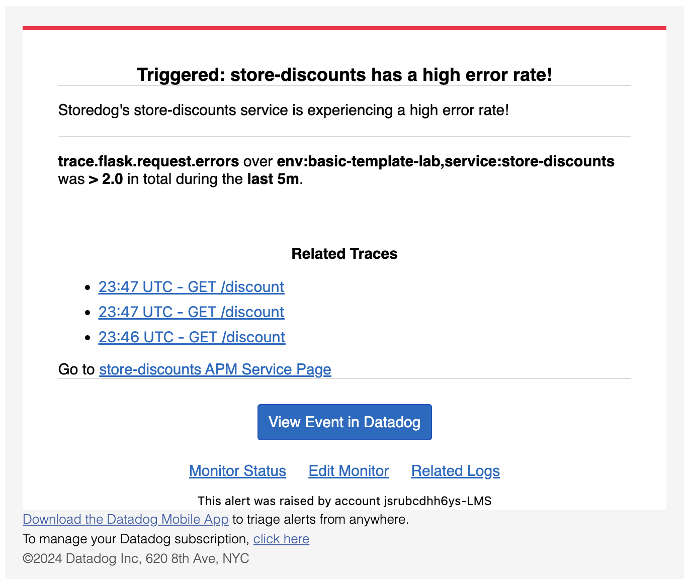
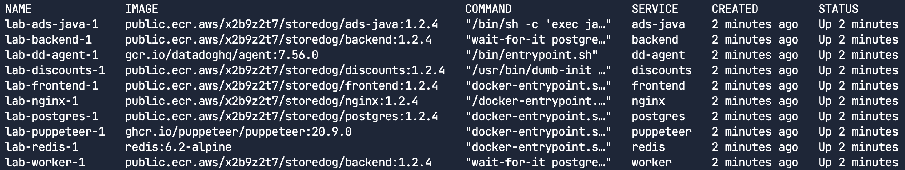
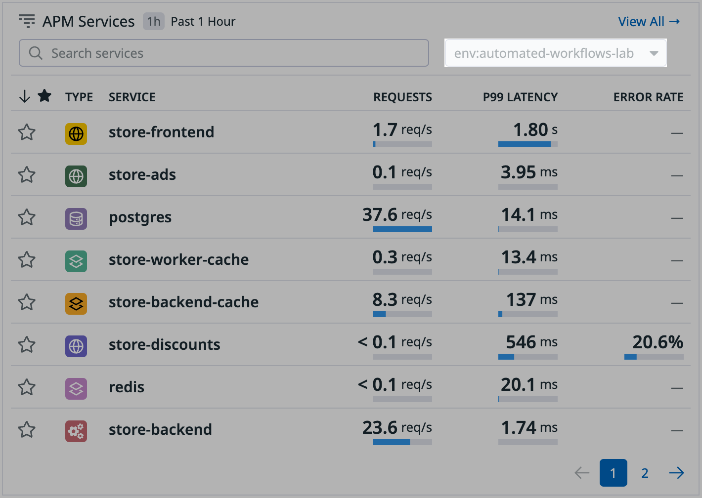
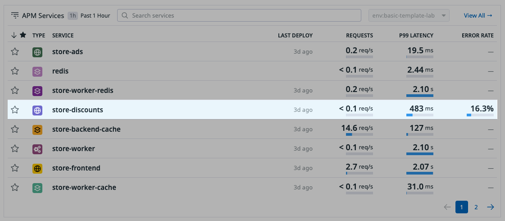
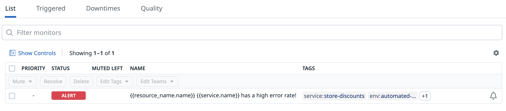
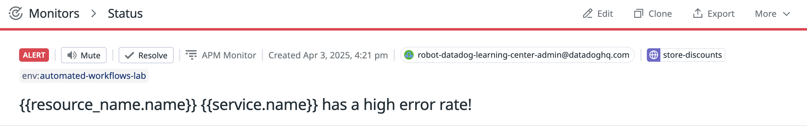
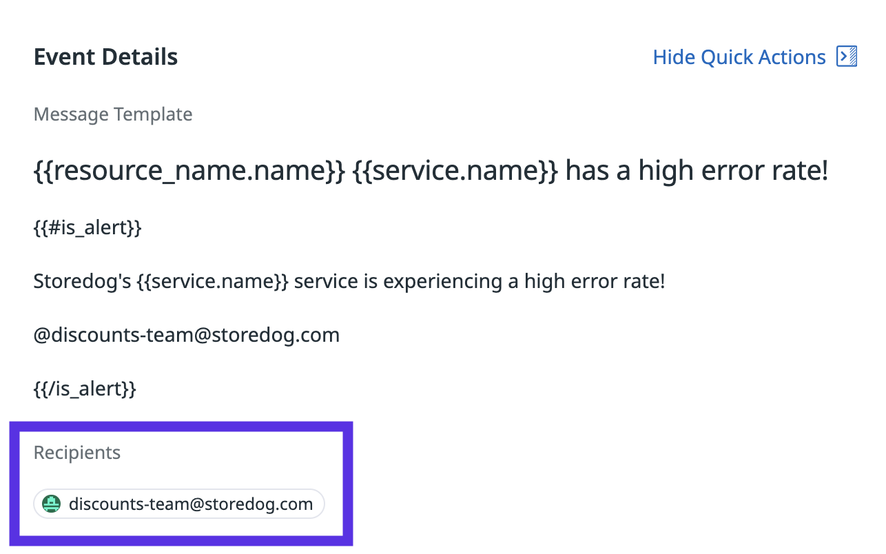
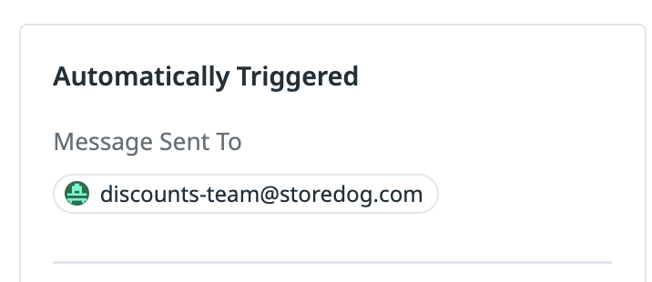
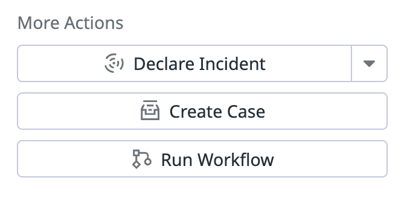

Your team at Storedog has instrumented the app's services for Datadog Application Performance Monitoring (APM). The team has also set up a monitor to track the error rates for the Discounts service of the app and send the team an email each time the monitor is in the alert state. 

On-call team members are often alerted that the service is experiencing high error rates (example email below). Customers also often report errors when they try to use discounts in the app.



To speed up response and remediation of future issues, your team lead has asked you to create a workflow that is triggered by the monitor and performs a set of tasks for prompt response and remediation. 

In this lab, you'll complete four activities as you build, configure, and test the workflow and its components.

In this first activity, you'll do the following:

1. Review the list of components that you'll add to the workflow
1. Confirm that the app is online in the lab environment 
1. Configure the monitor to act as the trigger in the workflow. 

Review the list of workflow components
===

The workflow (shown below) should have the following actions (listed in bold) and perform the following tasks: 

- **Monitor trigger** - Automatically trigger when the associated monitor enters alert status
- **Update Notebook** - Log remediation progress in a Datadog Notebook
- **Check Service Error Monitor** - Check the status of the monitor to determine if the issue is resolved 
  - **Declare Incident** - If the monitor is still in alert status: Declare an incident. _(This is the `Error path` seen in the workflow below.)_
  - **Update Notebook** - If the monitor is _not_ in alert status: Log a resolution message to the Datadog Notebook. _(This is the path in the bottom left of the workflow below.)_

 

> [!IMPORTANT]
> Due to the limitations of the lab environment, actions for team messaging apps (such as Slack) and actions for CI/CD tools (such as Gitlab) are not included in the workflow. However, the lab includes explanations of where in the workflow you would include these actions if this were a "real-world" scenario.

You've reviewed the workflow components and are ready to configure the monitor. Before you do, you'll confirm that the environment is online and that Datadog is collecting APM data from Storedog. 

Confirm that the app is online
===

The Storedog app came online when you launched the lab environment. 

1. In the **[lab terminal](tab-0)**, run the following command to confirm Storedog's services are up and running:

    ```bash,run
    docker compose ps
    ```

    You should see a list of services:

    

    Example terminal output (partial):

    ```nocopy
    NAME              IMAGE                                              COMMAND                  SERVICE     CREATED         STATUS                   PORTS
    lab-ads-java-1    public.ecr.aws/x2b9z2t7/storedog/ads-java:1.2.4    "/bin/sh -c 'exec ja…"   ads-java    7 minutes ago   Up 7 minutes             0.0.0.0:9292->8080/tcp, :::9292->8080/tcp
    lab-backend-1     public.ecr.aws/x2b9z2t7/storedog/backend:1.2.4     "wait-for-it postgre…"   backend     7 minutes ago   Up 7 minutes             0.0.0.0:4000->4000/tcp, :::4000->4000/tcp
    lab-dd-agent-1    gcr.io/datadoghq/agent:7.56.0                      "/bin/entrypoint.sh"     dd-agent    7 minutes ago   Up 7 minutes (healthy)   0.0.0.0:8125->8125/udp, :::8125->8125/udp, 0.0.0.0:8126->8126/tcp, :::8126->8126/tcp
    lab-discounts-1   public.ecr.aws/x2b9z2t7/storedog/discounts:1.2.4   "/usr/bin/dumb-init …"   discounts   7 minutes ago   Up 7 minutes             0.0.0.0:8282->8282/tcp, :::8282->8282/tcp
    ```

1. In a new browser tab, log into Datadog at [app.datadoghq.com](https://app.datadoghq.com/) using the credentials in the lab terminal. 

    >[!NOTE]
    > You can run the command `creds` in the terminal to retrieve your credentials at any time.
    > ```bash,run
    > creds
    > ```

1. In Datadog, in the main menu, click **[APM](https://app.datadoghq.com/apm/home)** to go to the APM home page. 

1. If necessary, update the dropdown in the upper-right of **APM Services** to read `env:automated-workflows-lab`. This ensures only services from this lab are visible. 

    

1. Review the list of **APM Services**. You'll notice Storedog's Discounts service, `store-discounts`, is reporting an abnormally high error rate (while the other services aren't reporting any errors).

    

    > [!NOTE]
    > It may take several minutes for the list of services and error rates in the `store-discounts` service to appear.
    > 
    > If you don't see the `store-discounts` service in the list, click the number `2` below the list to view the remaining services. 

This high error rate has been impacting Storedog's performance and user experience. There is already a monitor tracking these errors, but the monitor is not configured as the workflow trigger. You'll set this up next. 

Explore the monitor
=== 

To configure the monitor as a trigger, you must add the workflow handle to the monitor message. Take a moment to get familiar with the existing monitor.  

1. In Datadog, navigate to **[Monitors](https://app.datadoghq.com/monitors/manage)** to view the Monitors List.

1. In the list of monitors, click the monitor named **{{resource_name.name}} {{service.name}} has a high error rate!** to open the monitor's status page. 

    

    >[!NOTE]
    > If you have mutliple monitors listed, you can search the list of monitors using the `env:automated-workflows-lab` tag.

1. Notice that the monitor is in the `ALERT` status. 

    

1. Scroll to the event details. Notice that the message of the monitor includes an email handle `@discounts-team@storedog.com`. You're going to replace this email handle with the workflow handle.

    

1. Under **Event timeline**, click the event with the `ALERT` label.

1. With the `ALERT` event selected, notice that this event automatically triggered a message to `discounts-team@storedog.com`.

    

1. Under **More Actions**, find the **Run Workflow** action.

    

    After you create your workflow, you will be able to trigger it manually using this action. 
    
Next, you'll update the monitor message with the workflow handle. Then, you'll create the workflow directly in Workflow Automation in Activity 2 of the lab.

Configure the monitor as the workflow trigger
=== 

1. In the top right of the monitor status page, click **Edit**. 

1. Scroll down to **Configure notifications & automations**. 

1. In the body of the alert message, replace the email address (including the `@` preceding it). Below `{{is_alert}}` with the following workflow handle: 

    ```copy
    @workflow-fix-discounts-lab(service_name=service.name)
    ```

    

    This is the handle of the automated workflow that you'll construct next. When the monitor status changes, it will invoke this workflow instead of sending an email to the team.

    > [!WARNING]
    > You'll see the following warnings below the alert message form:
    > 
    > `In message: This monitor is configured to trigger the workflow 'fix-discounts-lab' but no workflows match that handle. Please check that there is a workflow configured with the given handle.`
    >
    > `In message: @workflow-fix-discounts-lab is used in is_alert but not in is_recovery or is_alert_recovery. No recovery notification will be sent.`
    >
    > You can ignore these messages. The first message will disappear after you create the workflow and add the monitor as a trigger. Regarding the second message, the workflow is only triggered when the monitor goes into the ALERT state.

1. Click the **Save** button in the lower-right. You'll be redirected to the monitor's status page. 

Your monitor is ready for the workflow!

> [!NOTE]
> Keep your monitor open in a browser tab to reference in the next activity. 

Activity summary
==============

Nice work! In this activity, you did the following:

1. Reviewed the list of components that you'll add to the workflow
1. Confirmed that the app is online in the lab environment 
1. Configured the monitor to act as the trigger in the workflow 

To start building the workflow, click the **Next** button in the lower-right corner of the lab environment.
