In the previous activity, you configured the monitor to serve as a trigger for the automated workflow.

In this activity, you'll do the following:

1. Create the workflow and add the monitor trigger action
1. Add an input parameter to the workflow
1. Configure the **Update notebook** action
1. Test the configured **Update notebook** action

You (and anyone on the Storedog team) can refer to this notebook to see the current status of the workflow and what it has most recently reported.

Create a new workflow with the monitor trigger
===

In this section, you'll create a new workflow directly in Workflow Automation and add the monitor as the trigger. 

1. In Datadog, use the main navigation to open **[Actions > New Workflow](https://app.datadoghq.com/workflow/create)** in a new browser tab.

    This takes you to the landing page for creating new workflows. There’s more to explore on the main [Workflows page](https://app.datadoghq.com/workflow/intro), but this activity will focus on developing a new workflow here.

1. In the **Get Started with Workflows** modal, under **Datadog Triggers**, select **Monitor**. This instantiates a workflow that can be triggered by the monitor you edited earlier.

    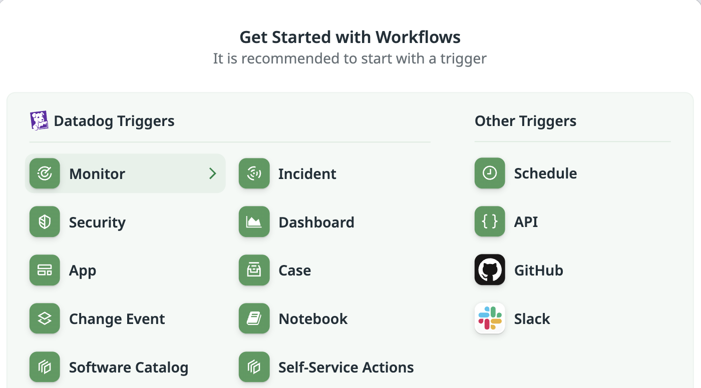

    A trigger answers the question _"When should this workflow run?"_ With your selection, the answer is _"Whenever this monitor notices recurring error rates above its alert threshold."_

1. Next, update the trigger's handle to match the workflow handle referenced in your monitor. Click the **Monitor** trigger action in the workspace to open the action's details in the sidebar on the right. 

    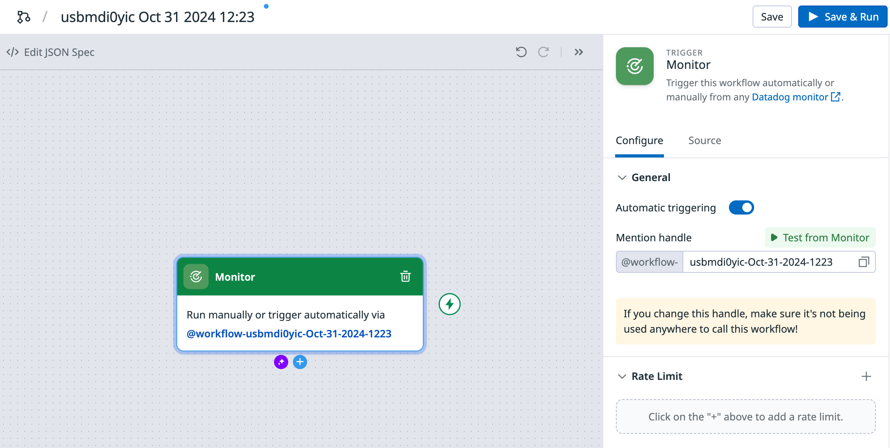

1. In the sidebar, replace contents of the **Mention handle** field with the following: 
    
    ```copy
    fix-discounts-lab
    ```

    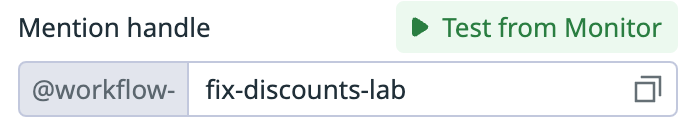

    This is the handle of the workflow that will be triggered from the monitor when it enters an alert status. It matches the workflow handle you added to your monitor's alert message in the previous activity.
    
    > [!NOTE]
    > In your monitor, you referenced `@workflow-fix-discounts-lab`:
    > 
    > 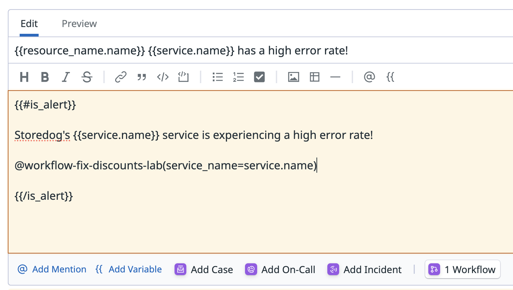
    > 
    > You only need to insert `fix-discounts-lab` in the **Mention handle** field because `workflow-` is automatically appended to all workflow handles. 

1. Unselect the **Monitor** trigger by clicking anywhere in the gray workspace. In the sidebar, settings for the **Monitor** trigger will be replaced with settings for the overall workflow: 

    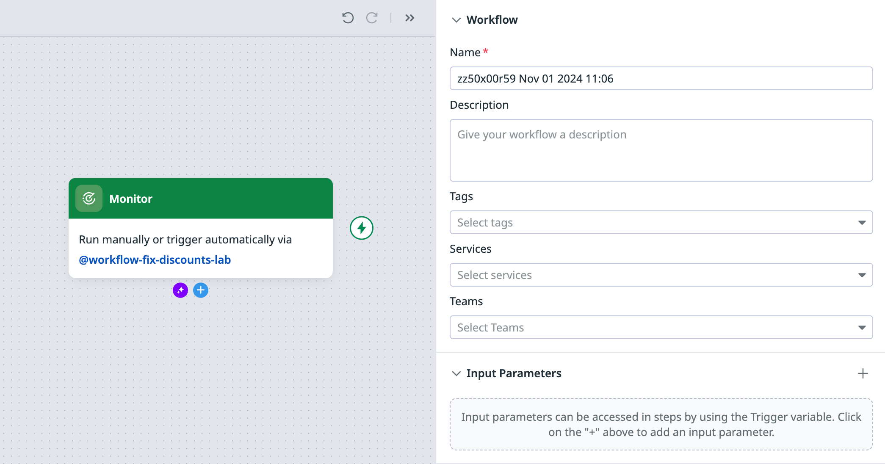

1. Update the **Name** field with a more readable workflow name: 

    ```copy
    Lab: Remediate Discounts Service Errors
    ```

    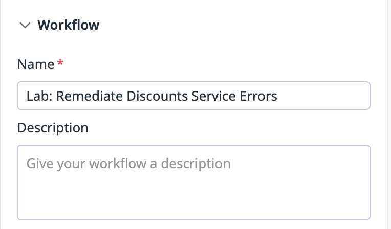

> [!IMPORTANT]
> **Save your progress regularly to avoid losing work!** 
> 
> As you construct your workflow, click the **Save** button in the upper-right after each step. 

Add an input parameters to the workflow 
===

Remember, the alert message in your monitor looks like this:

```
@workflow-fix-discounts-lab(service_name=service.name)
```

When you reference the `@workflow-fix-discounts-lab` workflow, you pass a `service_name` parameter containing the name of the relevant service. 

Next, you'll configure your workflow to accept this parameter. 

1. Click the **Monitor** trigger action again to open its details in the sidebar. 

1. Select the **Source** tab. This opens a list of properties.

1. Expand the **monitor** property. As you can see, this trigger contains a lot of information: 

    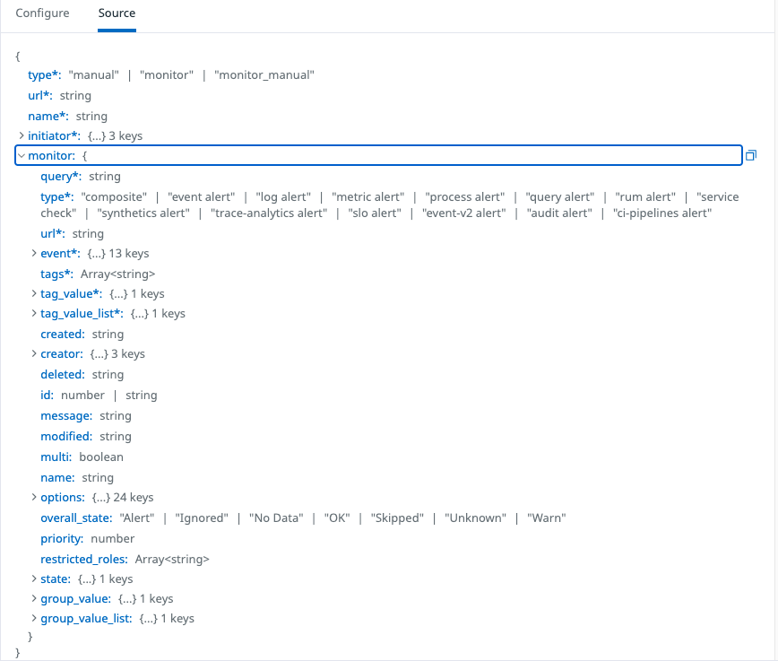

    The `service_name` provided by the monitor's alert message is _**not**_ listed here. You'll need to add this parameter to the workflow manually.

1. Click outside of the **Monitor** trigger to revisit workflow settings in the sidebar. Under **Input Parameters**, click the **+** button.

    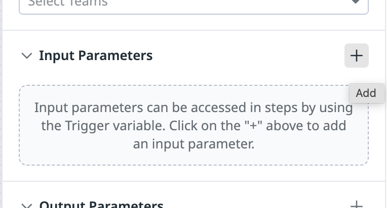

1. In the resulting modal, insert the following **Parameter Name**:

    ```copy
    service_name
    ```

    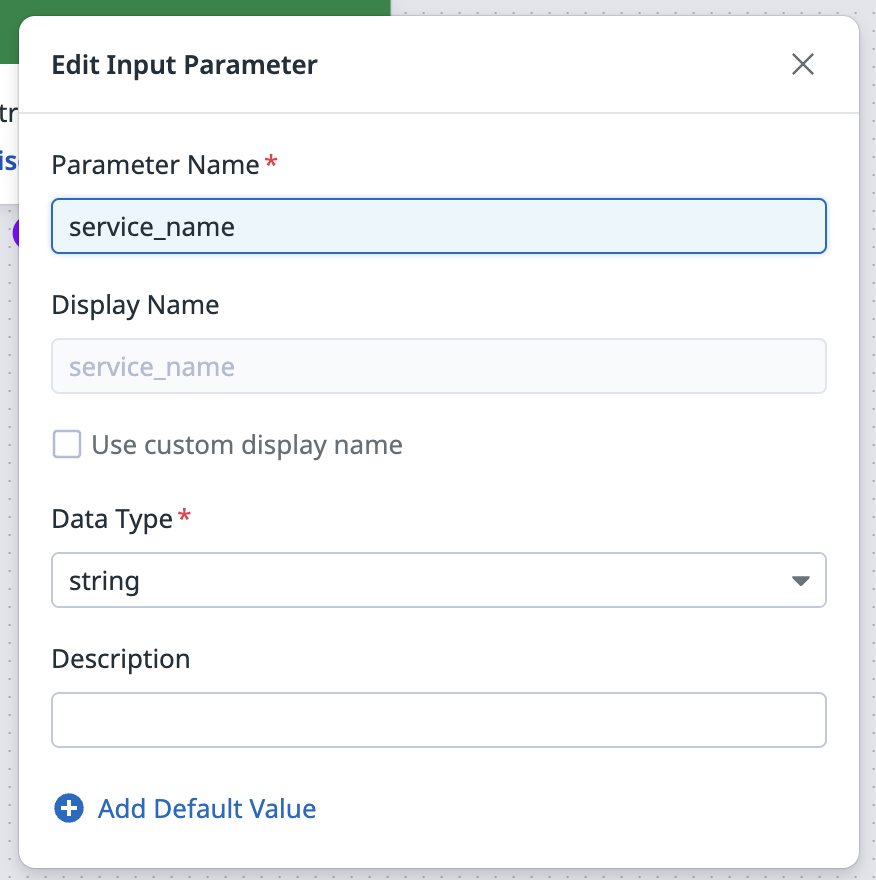

    `service_name` is now a required parameter of the workflow. When triggered from your monitor, the alert message will provide this value. If triggered manually, `service_name` will need to be provided manually. 

1. Click anywhere in the gray workspace to exit the form. Your new input parameter will be automatically saved.

You've properly configured the monitor trigger. Next, you'll add the action to update the notebook with the monitor status.

Configure the **Update notebook** action
===

Most teams integrate workflows with messaging services like Slack or Microsoft Teams. This alerts relevant stakeholders of issues and keeps them informed of any automatic remediation efforts using their regular communication channels. 

In a "real world" scenario, you'd likely do this too. You would configure a _Send Message_ action that contacts your preferred messaging service with Datadog's [Slack](https://docs.datadoghq.com/integrations/slack/?tab=datadogforslack) or [Teams](https://docs.datadoghq.com/integrations/microsoft_teams/) integrations. 

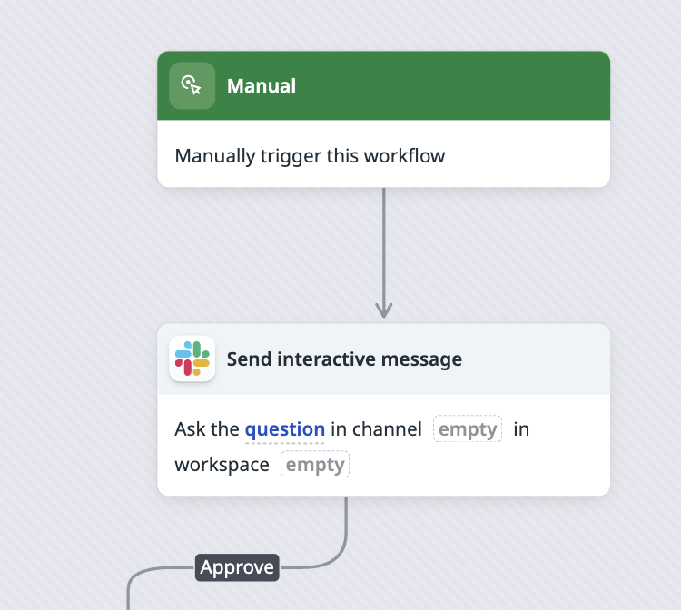

Then, you'd configure this action with the necessary parameters to contact your desired workspaces, channels, or individuals, before adding it to your workflow. 

However, due to the limitations of the lab environment, you'll configure the workflow to send updates to a Datadog Notebook instead of a message app.

Datadog offers many prebuilt workflow actions. To update your notebook, your workflow will use the **Update notebook** action. 

1. Below the **Monitor** trigger, click the circular blue **+** button to add a new action to the workflow. This opens a modal.

1. Search for `update notebook` in the modal's search field, and select the **Update notebook** action.

    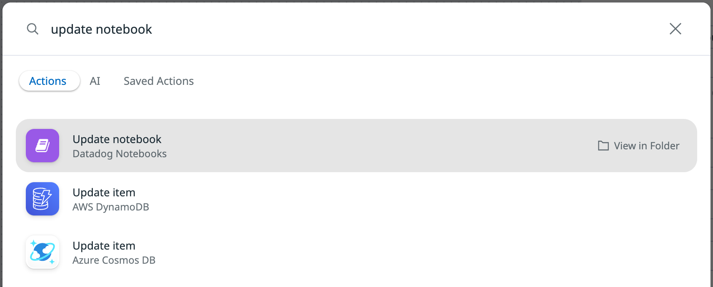

    You'll see that a second step has been added to your workflow and a new form has appeared in the sidebar:

    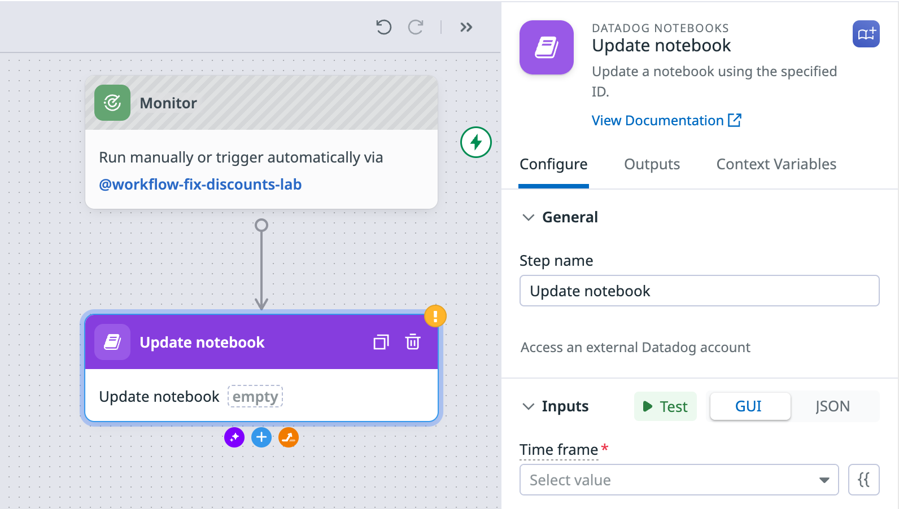

1. Next, configure the **Update notebook** action. In the sidebar, under **Inputs**, expand the **Time frame** dropdown and select **Past 1 Hour**. 

1. Click the **Notebook ID** field to reveal a list of notebooks in your account. Select **Storedog Notebook**. (This notebook was automatically generated for you by the lab environment). 

1. Next, copy and paste the following into the **Cells** field:

    ```json
    [
      {
        "attributes": {
          "definition": {
            "text": "## Workflow remediation report\n\nStoredog's Discounts service has been experiencing a high HTTP request error rate.\n\nThe current monitor status is: `OK`\n\n**Workflow**: `fix-discounts-lab` has been triggered and was successful in its attempt to auto-remediate the issue. No human intervention is required at this point.\n\n* [Workflow]({{ workflow_url }})\n* [Monitor]({{ monitor_url }})\n\n\n### HTTP Request Error timeline for Discounts service",
            "type": "markdown"
          }
        },
        "type": "notebook_cells"
      },
      {
        "attributes": {
          "definition": {
            "requests": [
              {
                "display_type": "bars",
                "q": "sum:trace.flask.request.errors{env:automated-workflows-lab,service:store-discounts}.as_count()",
                "style": {
                  "line_type": "solid",
                  "line_width": "normal",
                  "palette": "warm"
                }
              }
            ],
            "show_legend": true,
            "type": "timeseries",
            "yaxis": {
              "scale": "linear"
            }
          },
          "graph_size": "m",
          "split_by": {
            "keys": [],
            "tags": []
          },
          "time": null
        },
        "id": "abcd1234",
        "type": "notebook_cells"
      }
    ]
    ```

    The **Update notebook** action uses the Datadog API's [Update a Notebook endpoint](https://docs.datadoghq.com/api/latest/notebooks/#update-a-notebook). The JSON block above defines the notebook cell (content) this action's API request will insert into the notebook. 

    For more information on each 
    of these values, other available options, and additional example payloads, see the [Update a Notebook Datadog API documentation](https://docs.datadoghq.com/api/latest/notebooks/#update-a-notebook).
    
1. In the **Name** field, insert the name of your notebook:
   
    ```copy
    Storedog Notebook
    ```

    The form should look like this:

    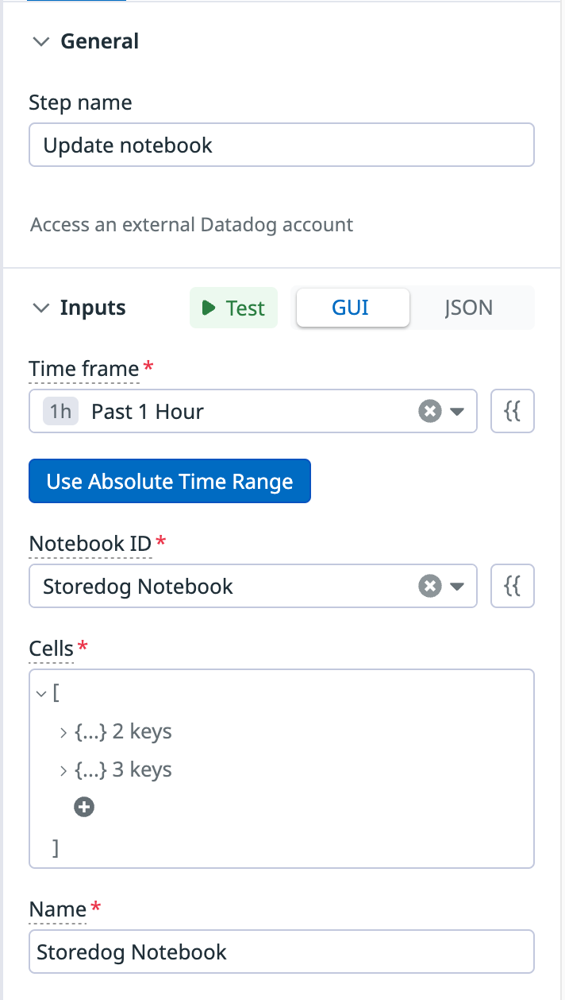

    > [!NOTE]
    > It's okay if you see a warning icon next to the `definition` key. Continue with lab steps.
    > 

1. Click the **Save** button in the upper-right to save your work. 

You've configured the **Update notebook** action, but you should test it to make sure that it works properly.

Test the **Update notebook** action
===

You can use the Test button that is available in the action. 

1. In the **Update notebook** settings in the sidebar, under **Inputs**, click the **Test** button. A modal will appear with information you've entered for the **Update notebook** action:

    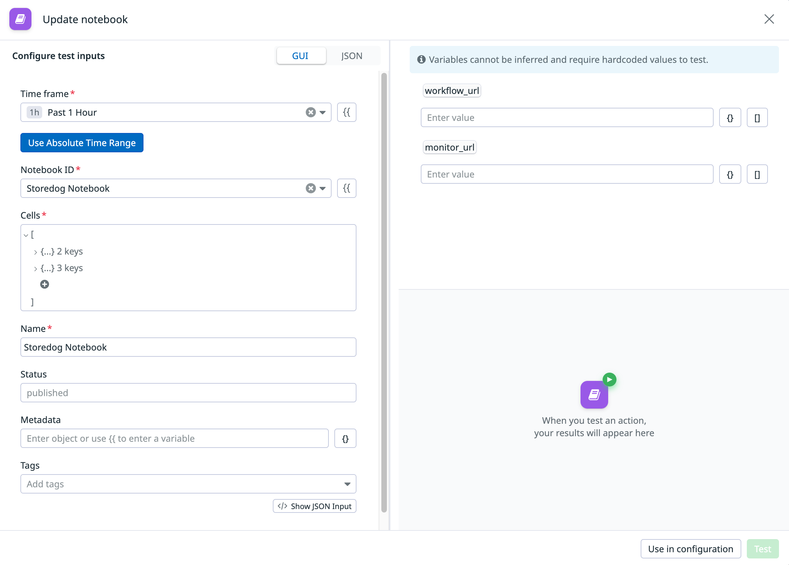

    You should see a message in the upper-right reading: `Variables cannot be inferred and require hardcoded values to test.` If you don't, click the **Test** button in the lower-right corner of the modal and it should appear. 

1. Next, you'll add these variables to your test as described by the message. The right half of the modal contains fields for **`workflow_url`** and **`monitor_url`**. Complete these as follows:

    1. In the browser tab containing the **Update notebook** modal from the image above, copy the workflow's ID from the URL in your browser's address bar.

        The ID is the string between `/workflow/` and `#step-Update_notebook`. For example, if your browser contained the following URL:
        
        ```
        https://app.datadoghq.com/workflow/abe7ae48-12a5-4af8-81a0-7a74acbe989c#step-Update_notebook
        ```
        
        The ID value would be `abe7ae48-12a5-4af8-81a0-7a74acbe989c`. 

    1. Paste this value into the **workflow_url** field on the right.

    1. For `monitor_url`, paste the following:

        ```
        https://app.datadoghq.com/monitors/[[ Instruqt-Var key="LABVAR_MONITOR_ID" hostname="lab-host" ]]
        ```      

    1. Return to the browser tab containing the **Update notebook** modal. Paste the URL into the **monitor_url** field on the right.

      

1. Click the **Test** button in the lower right. Under **Test results** you should see information about the update action you just performed on your Storedog Notebook:

    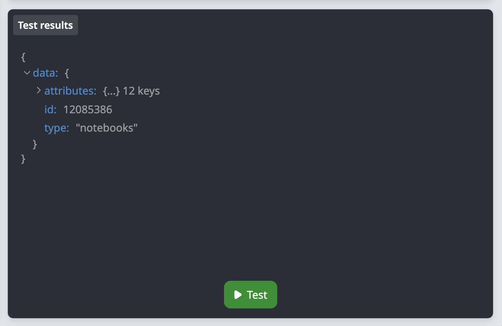

    Feel free to expand and explore this data. 

1. Click the **Use in configuration** button to save your changes. 

    > [!IMPORTANT]
    > Be sure to complete this step before proceeding! If you don't, you'll have to manually enter **`workflow_url`** and **`monitor_url`** values each time you test your **Update notebook** action. 

1. Click the **x** in the upper-right of the modal to exit.

1. Next, you'll confirm the test was successful. Navigate to **[Dashboards > Notebooks](https://app.datadoghq.com/notebook/list)** and select the **Storedog Notebook**. 

    You should see that testing your action has resulted in an entry in your notebook! 

    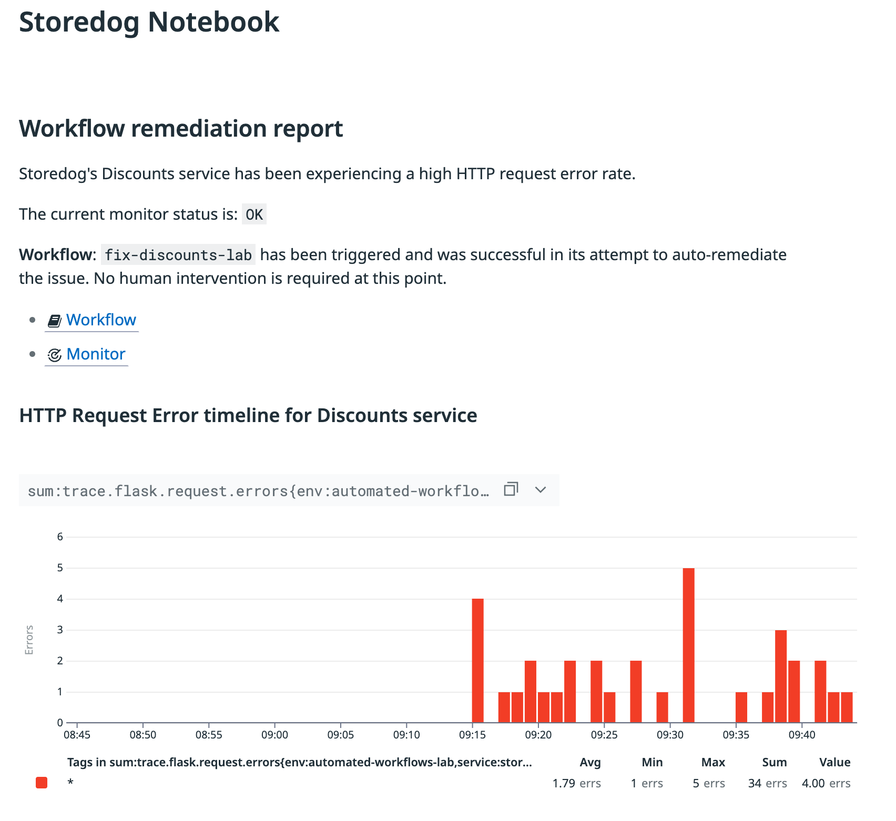

    Great! Your test worked, confirming your new **Update notebook** action is functional.

    Now, each time the workflow is invoked, your workflow will automatically record this content at the first stage of remediation. 

This configured **Update notebook** action will be the foundation of all messages you send to the notebook in your workflow. You'll also duplicate and reuse this action (with changes to the message content) at other points in the workflow. 

Activity summary
===

Great work defining the first few steps of your new workflow! In this activity, you completed the following:

1. Created the workflow and add the monitor trigger action
1. Added an input parameter to the workflow
1. Configure the **Update notebook** action
1. Tested the configured **Update notebook** action
  
In the next activity, you'll continue developing your workflow; including adding branching to complete different actions depending on whether remediation is successful. 

Click the **Next** button below to advance. 
