You've set up the **Update notebook** action to keep your team informed about the status of the Discounts service issue. Now, you're going to set up the remaining actions in the workflow.

At this point, if this were a "real-world" scenario, you'd add an action to autoremediate the detected issue. If you team uses Github, you might use an action, such as **Trigger github actions workflow run**, to implement a fix or to rollback the latest change to the `store-discounts` service in attempt to resolve its high error rates.

Due to the limitations of the lab environment, you will not add the action for autoremediation. However, the first section below will walk you through how to configure the **Trigger github actions workflow run** action in a workflow. In Activity 4, you'll test the workflow. You'll manually implement a fix for the issue, in lieu of the autoremediation action, to test the remediation success path.

After reviewing the **Trigger github actions workflow run** action, you'll configure the remaining actions in the workflow:

1. A **Get monitor** action to check the monitor state after remediation
1. An **Update notebook** action to add the current monitor state if remediation was successful
1. An **Open an incident** action for the error path if remediation is not successful

Review the remediation action
===

Most applications and codebases use one of the following popular CI/CD workflow tools to manage their delivery and deployment processes:

- [GitHub Actions](https://github.com/features/actions)
- [CircleCI Workflows](https://circleci.com/docs/workflows/)
- [GitLab CI](https://docs.gitlab.com/ee/ci/)
- [Jenkins Pipelines](https://www.jenkins.io/doc/book/pipeline/)

Datadog Automated Workflows offers a [catalog of ready-made actions](https://docs.datadoghq.com/service_management/workflows/actions_catalog/) to integrate with these tools. These actions can be added to workflows to automatically attempt remediation steps like rollbacks, service restarts, redeploys, and more.

As an example, you'll review how to setup a remediation action that uses GitHub Actions.

1. Return to your **Lab:Remediate Discounts Service Errors** workflow.

1. Under the **Update notebook** action, click the plus icon to add another action.

1. In your real Datadog account, a **Trigger github actions workflow run** action could be added to your Datadog workflow. Begin by searching for `github actions`.

    ```
    github actions
    ```

1. Select the **Trigger github actions workflow run** action.

    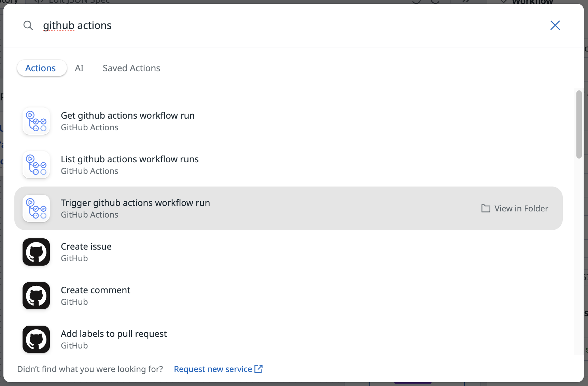

    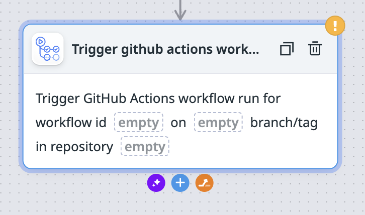

    This would allow the workflow to contact GitHub, and run an existing GitHub Action on Storedog's repository.

1. You can leverage a **Saved Action** to configure the **Trigger github actions workflow run** action.

    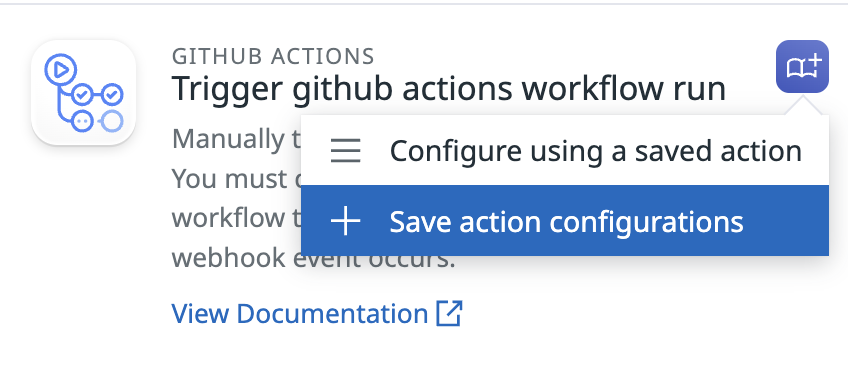

    A **[Saved Action](https://docs.datadoghq.com/service_management/workflows/saved_actions/)** is a custom, preconfigured action you can create and seamlessly re-use in your Datadog workflows. You can insert a saved action into your workflow as a new step, or you can use one to populate an existing step's parameters. Try it now.

    1. Add the Saved Action's name and description.

        Saved action name

        ```
        Perform Service Restart
        ```

        Saved action description

        ```
        Perform a restart for Storedog's Discounts Service
        ```
    
    1. Add the following parameters:

        Github workflow filename or ID

        ```
        Perform Service Restart
        ```

        Repository

        ```
        storedog/workflows-lab
        ```

        Ref

        ```
        main
        ```

        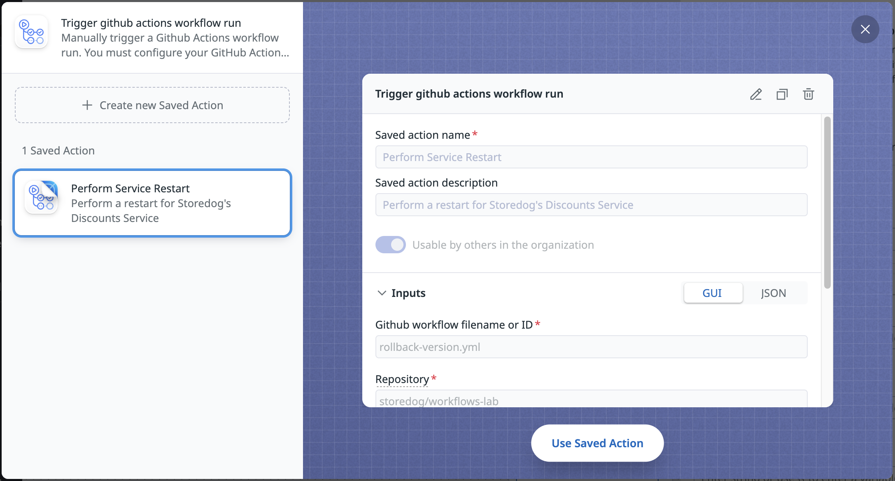

    1. Click **Save Action Configuration**.

    1. Click **Use Saved Action** to use your new saved action in the workflow you are building.

       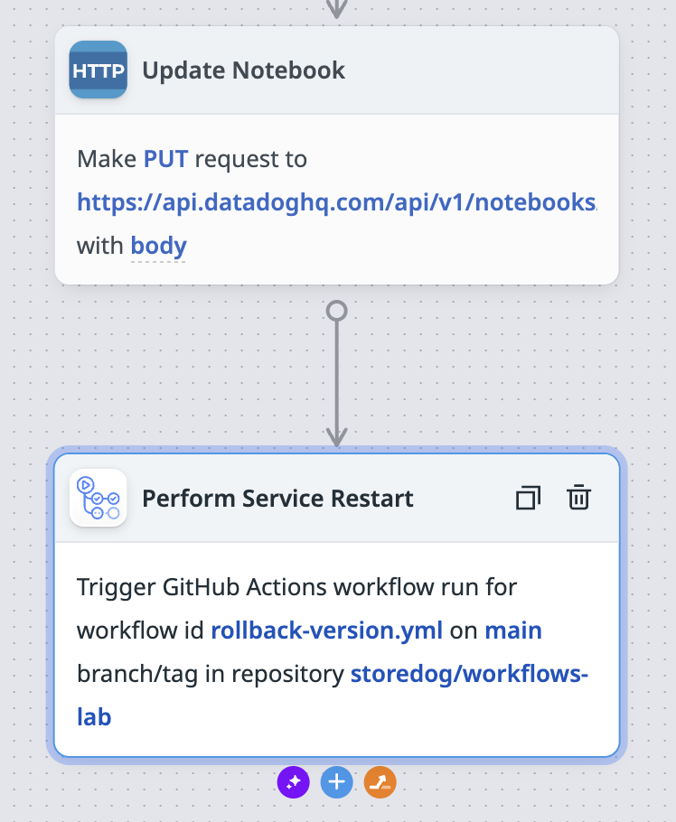

       You can also reuse this saved action in future workflows.

1. Make sure the **Perform Service Restart** action is selected and click the trash icon to delete the action. While this is a useful example of configuring a CI/CD remediation action, you will not be able to use it in your lab workflow. Your workflow should now look like the following image:

  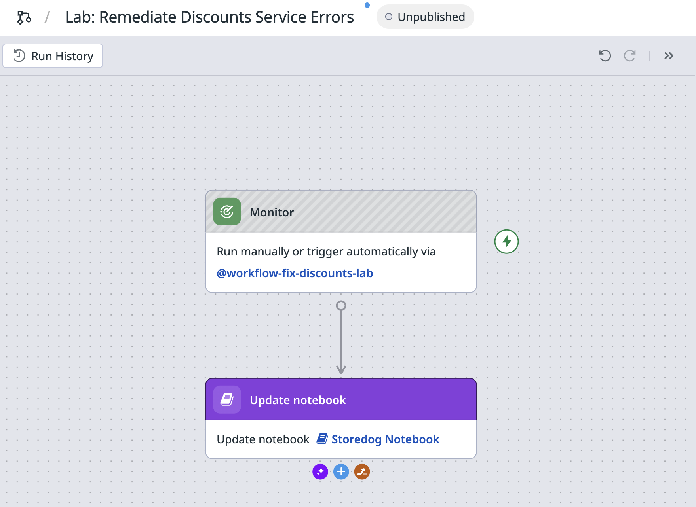

Next, you'll set up a **Get monitor** action to perform a health-check on the monitor.

Add a **Get monitor** action
===

In this workflow step, you'll configure a **Get monitor** action to retrieve the monitor and its state. If remediation was successful, the monitor will be in the OK state. After this step, you will create two potential paths for the workflow, depending on whether the monitor state.

1. In the workflow, click the blue **+** icon below the **Update notebook** action to add another step. In the modal that appears, search for and select the **Get monitor** action to add it to the workflow. Settings for the **Get monitor** action will also appear in the sidebar.

    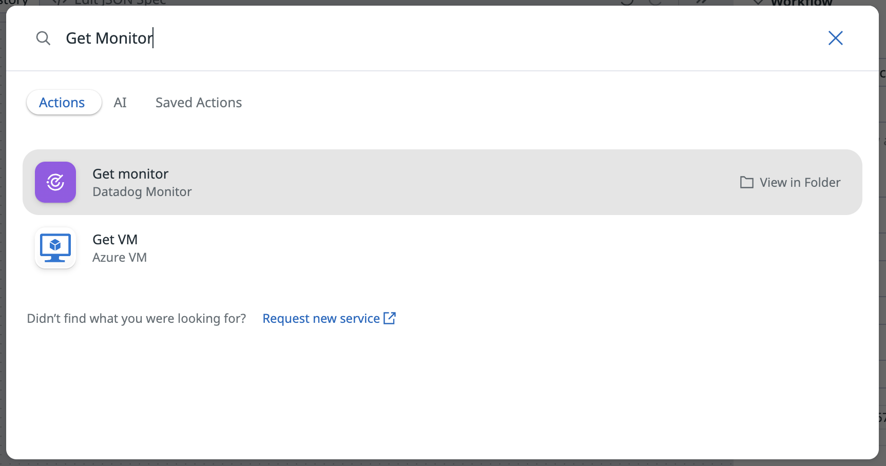

1. In the sidebar, under **General**, update **Step name** to:

    ```copy
    Check Service Error Monitor
    ```

1. Under **Inputs**, expand the **Monitor ID** dropdown. Select **Monitor ID** under **Context Variables**. This contains the `{{ Source.monitor.id }}` variable.

    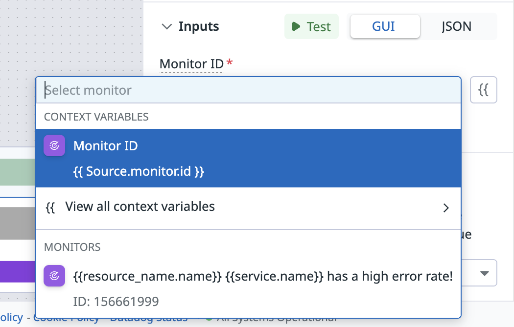

    By selecting this context variable, you'll retrieve the ID of the monitor that originally invoked this workflow. Using this ID, you can check the status of the monitor.

1. Under **Wait until condition**, open the **Wait until** dropdown and select **OK Status**. This way, as soon as the monitor enters an OK state, the workflow will proceed along its success path.

    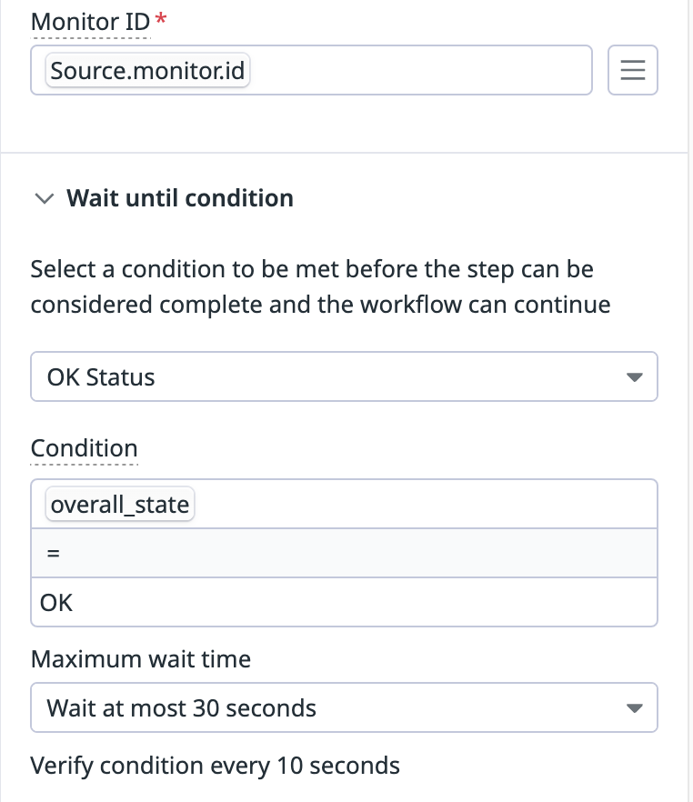

    You've now configured this action to check if your monitor is in an OK status.

    You can also set a **Maximum wait time** for this check. The default option (`Wait at most 30 seconds`, with a retry every 10 seconds) should work well for this lab use case. If monitor doesn't meet the condition after 30 seconds, it will then proceed down the failure path.

    > [!NOTE]
    > In the "real-world" scenarios, you might want the action to wait 5 minutes and verify every 20 seconds. It would take time for the GitLab action to trigger and deploy the fix. This way, as soon as the monitor enters an OK state, the workflow will proceed along its success path. If it doesn't meet the condition after 5 minutes, it will then proceed down the failure path.

Add an **Update notebook** action in the success path
===

If the **Check Service Error Monitor** action confirms the monitor is in an OK status (the issue is resolved), this **Update notebook** action will add an entry to the notebook summarizing this successful resolution.

Your first **Update notebook** action is already configured to update your notebook. You'll copy the action, update the **Cells** field with the new notebook entry, and save this new action.

1. Select the **Update notebook** action in your workflow. Click the **Copy step** option in its upper-right corner.

    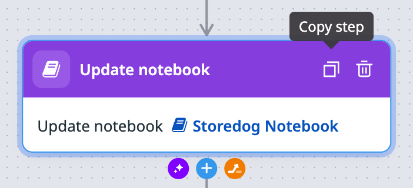

    This will create an identical action titled **Update notebook 1**.

1. Drag the new action down to the bottom left of the workflow path (where you'll define your successful path).

1. Click and hold the **+** button below the **Check Service Error Monitor** action. Drag over to the top of **Update notebook 1** to connect the steps.

    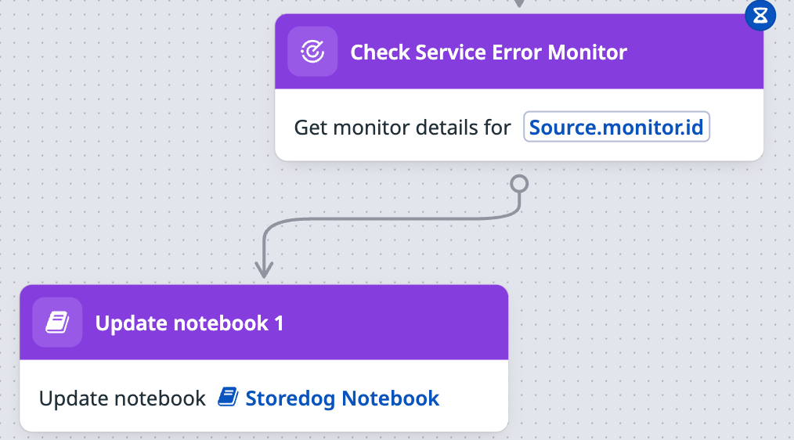

1. Select **Update notebook 1** to open its settings in the sidebar. Under **General**, copy and paste the following as the **Step Name**:

    ```copy
    Update Notebook Success
    ```

1. Under **Inputs**, hover over contents of the **Cells** field. Click the **X** that appears in the upper-right to empty the field.

    > [!IMPORTANT]
    > Make sure the **Cells** field is emptied **_entirely_** before advancing!

1. Copy and paste the following into the empty **Cells** field:

    ```json,copy
    [
        {
          "attributes": {
            "definition": {
              "text": "## Workflow remediation report\n\nStoredog's Discounts service has been experiencing a high HTTP request error rate.\n\nThe current monitor status is: `OK`\n\n**Workflow**: `fix-discounts-lab` has been triggered and was successful in its attempt to auto-remediate the issue. No human intervention is required at this point.\n\n* [Workflow]({{ workflow_url }})\n* [Monitor]({{ monitor_url }})\n\n\n### HTTP Request Error timeline for Discounts service",
              "type": "markdown"
            }
          },
          "type": "notebook_cells"
        },
        {
          "attributes": {
            "definition": {
              "requests": [
                {
                  "display_type": "bars",
                  "q": "sum:trace.flask.request.errors{env:automated-workflows-lab,service:store-discounts}.as_count()",
                  "style": {
                    "line_type": "solid",
                    "line_width": "normal",
                    "palette": "warm"
                  }
                }
              ],
              "show_legend": true,
              "type": "timeseries",
              "yaxis": {
                "scale": "linear"
              }
            },
            "graph_size": "m",
            "split_by": {
              "keys": [],
              "tags": []
            },
            "time": null
          },
          "id": "abcd1234",
          "type": "notebook_cells"
        }
      ]
    ```

    This updates the message that this action will write to your notebook.

1. Click the **Save** button in the upper-right corner of the page.

1. In the sidebar, under **Inputs**, click the **Test** button. A modal will appear. 

1. Use the same variables you used previously to test the first notebook action. In your lab, the `monitor_url` is as follows:

    ```
    https://app.datadoghq.com/monitors/[[ Instruqt-Var key="LABVAR_MONITOR_ID" hostname="lab-host" ]]
    ```  

    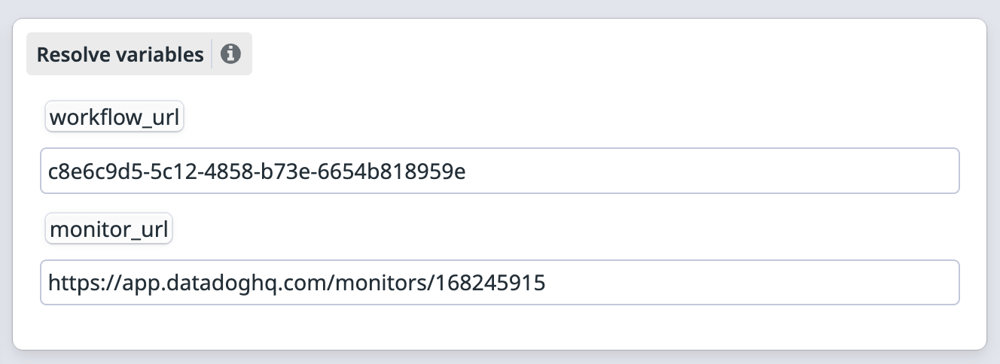

1. Click the **Test** button.

1. Check the **Test results** section. It will contain details about the new message your action just posted to your notebook:

    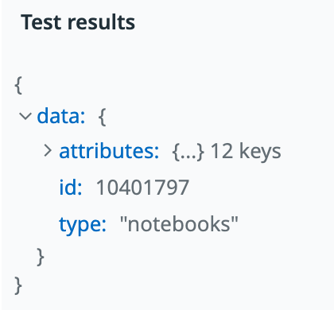

1. To confirm your test was successful, exit out of the test modal, and revisit your notebook by navigating to **[Dashboards > Notebooks](https://app.datadoghq.com/notebook/list)** and selecting **Storedog Notebook**.

    You should see a new message has been added to your notebook. It should say that `The current monitor status is: OK` and that `fix-discounts-lab has been triggered and was successful in its attempt to auto-remediate the issue. No human intervention is required at this point.`

    Great! The success path was able to summarize the remediation of the issue in your notebook.

Now that the success path is complete, you'll define the error path next.

Setting up the error path
===

If the remediation step didn't succeed and the monitor is still in alert status, the workflow will follow the error path.

At this stage, human intervention is required. This is typically indicated by opening an incident report, which will be your final step to complete the workflow.

Incident reports are typically handled by an incident management solutions like PagerDuty, Opsgenie, or Freshservice. These can be configured either manually or with a saved action (similar to the CI/CD saved actions you reviewed earlier).

In this section, you'll use [Datadog Incident Management](https://www.datadoghq.com/product/incident-management/) to create and report an incident from your workflow.

1. Return to your workflow by navigating to **[Service Mgmt > Workflow Automation](https://app.datadoghq.com/workflow?sort=-last_updated_at)** and selecting **Lab: Remediate Discounts Service Errors**.

1. In the workflow, click and hover over the **Check Service Error Monitor** action. Select the orange directional button that appears below it. This will initiate a new error path in your workflow.

    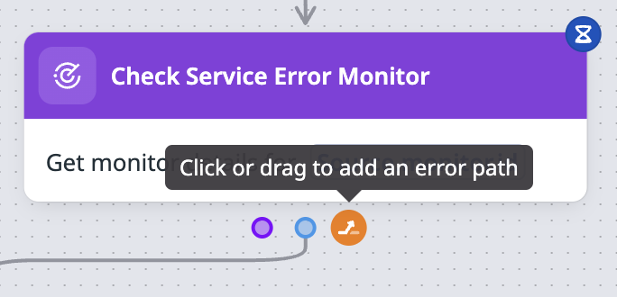

1. In the modal, search for `create incident` and select the **Create incident: Datadog Incidents** action from results.

    You'll see an orange directional line labeled `Error Path` that leads from the **Check Service Error Monitor** action to the new **Create incident** action:

    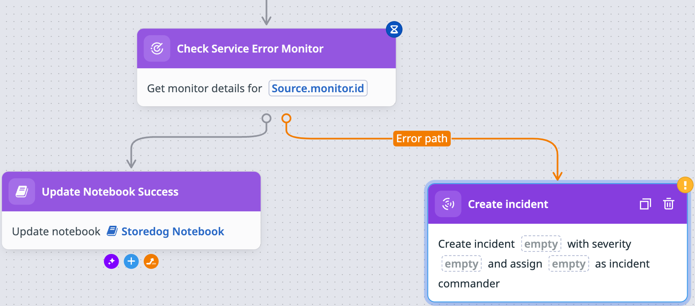

1. Click the new **Create incident** action to open its details in the sidebar. Copy and paste the text below as the **Step name**:

    ```copy
    Declare Incident
    ```

1. In the **Inputs** section, add the following **Title**:

    ```copy
    Storedog's Discounts service is experiencing a high error rate, as reported by a Monitor
    ```

1. Click the **Incident Commander** dropdown, and select the Datadog username generated for you in this lab. (It should be ten alphanumeric characters.)

    In a "real world" scenario, this list would contain actual teams and individuals at your company. You would select whichever team is responsible for resolving this incident.

1. Under **Incident Type**, select `General Incident`.

1. Under **Severity Level**, select `SEV-4` to mark this incident with a higher severity.

      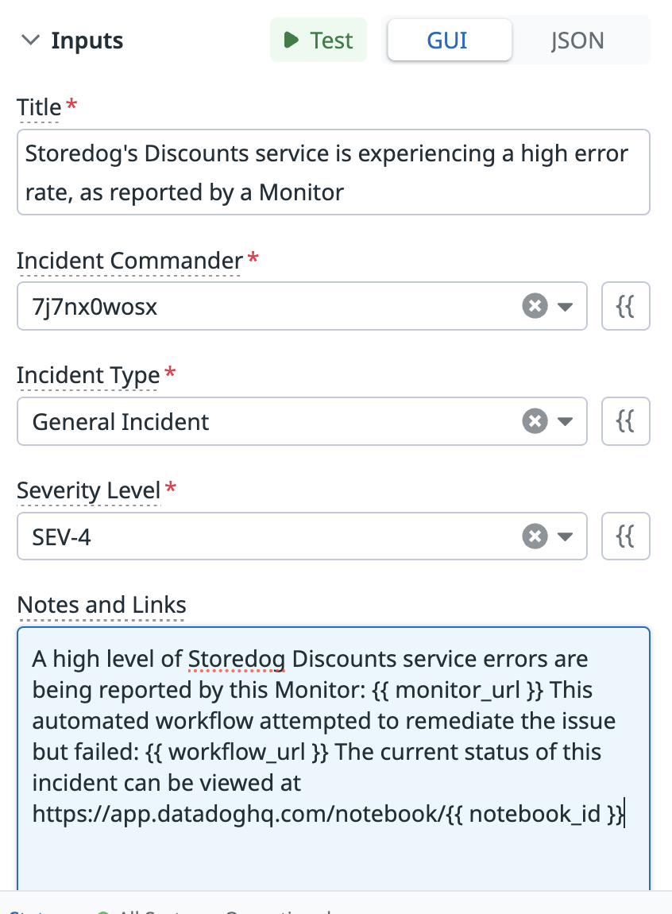

1. Copy and paste this message into the **Notes and Links** field:

    ```copy
    A high level of Storedog Discounts service errors are being reported by this Monitor: {{ monitor_url }}

    This automated workflow attempted to remediate the issue but failed: {{ workflow_url }}

    The current status of this incident can be viewed at https://app.datadoghq.com/notebook/{{ notebook_id }}
    ```

1. Click **Save** in the upper-right.

1. Click the **Test** button at the top of the **Inputs** section in the sidebar. A modal will open.

1. Like before, the right side of this modal contains the variables required to complete this action. **monitor_url** and **workflow_url** will already be populated using the values you provided in previous tests.

    To test this **Declare Incident** action, you'll also need to provide the **notebook_id**.

    ```
    [[ Instruqt-Var key="LABVAR_NOTEBOOK_ID" hostname="lab-host" ]]
    ```  

1. Return to the browser tab containing the **Declare Incident** test modal. Paste the notebook ID into the **notebook_id** field.

1. Click the **Test** button. The **Test results** section will return an object containing general information about the incident.

    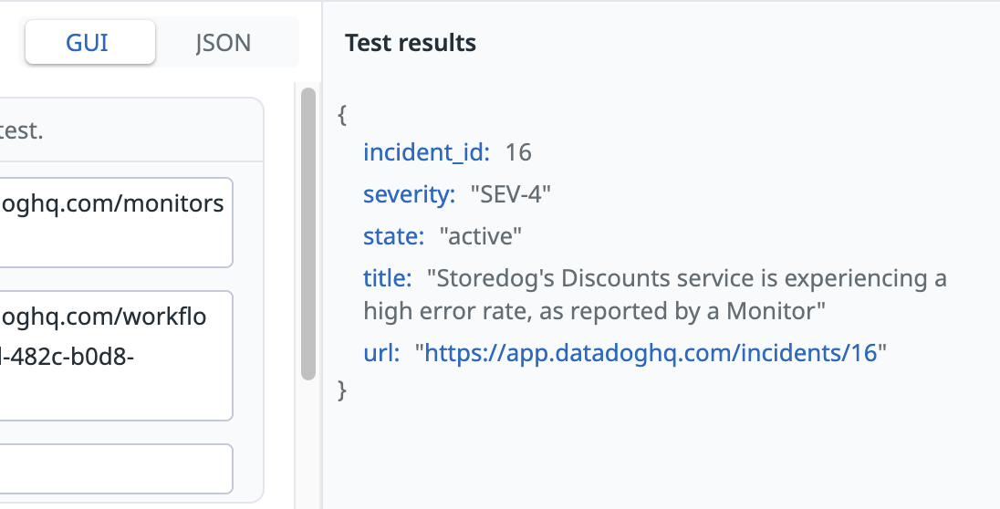

1. Click the `url` value listed in the **Test Results**. The incident will open in a new browser tab.

    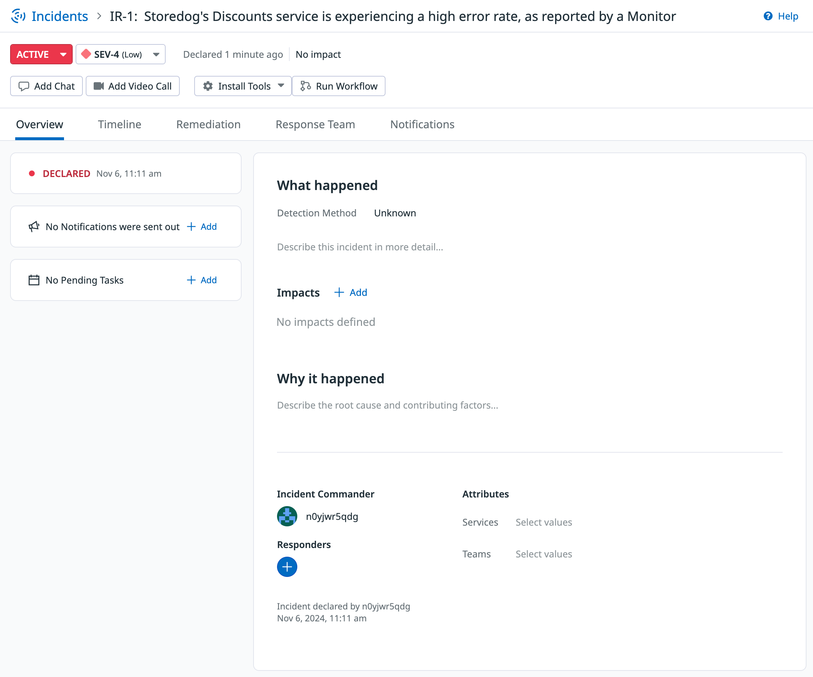

1. Next, click the **Timeline** tab to review your incident declaration and the information you included for the team members that will resolve this issue.

    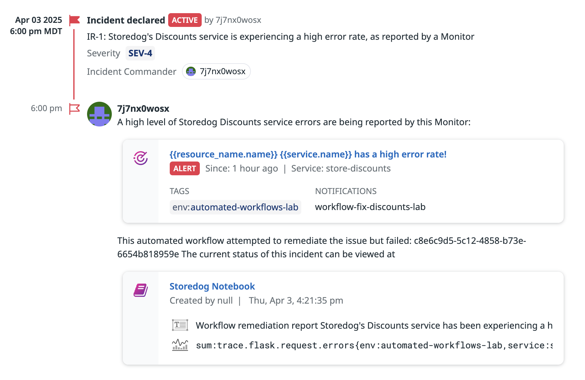

You've successfully configured the error path in the workflow!

Activity summary
===

Great work! You finished building the workflow!

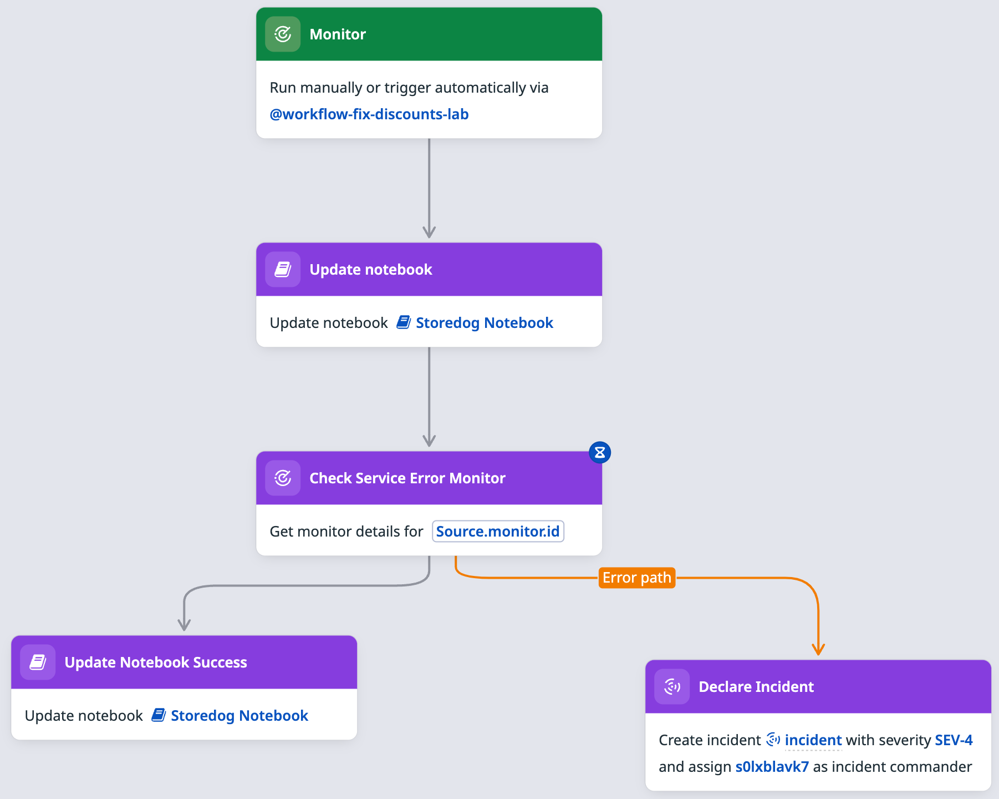

In this activity, you did the following tasks:

1. Reviewed the **Trigger github actions workflow run** action, as an example CI/CD tool remediation action
1. Added a **Get monitor** action to check the monitor state after remediation
1. Added an **Update notebook** action to add the current monitor state if remediation was successful
1. Added an **Open an incident** action for the error path if remediation is not successful

In the next and _final_ activity, you'll test the entire workflow before publishing it.

Click the **Next** button in the bottom right to continue.
