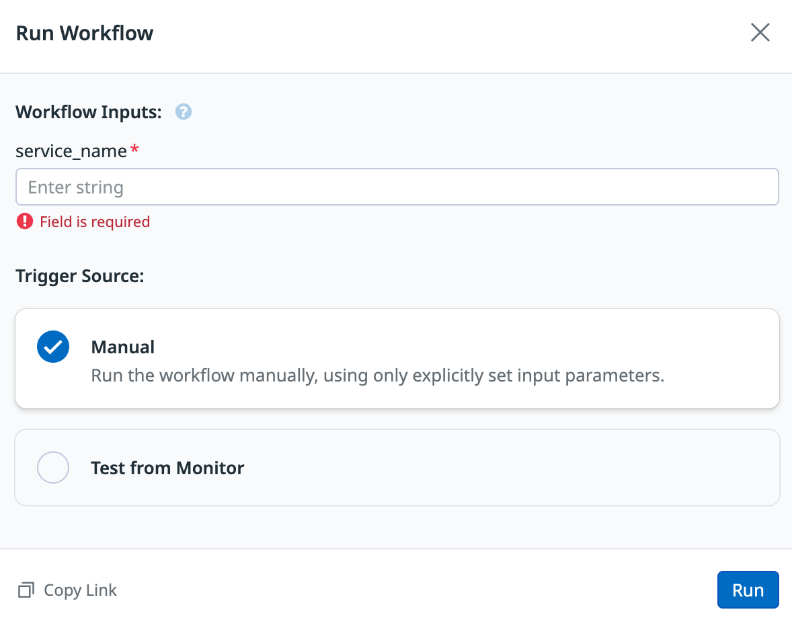
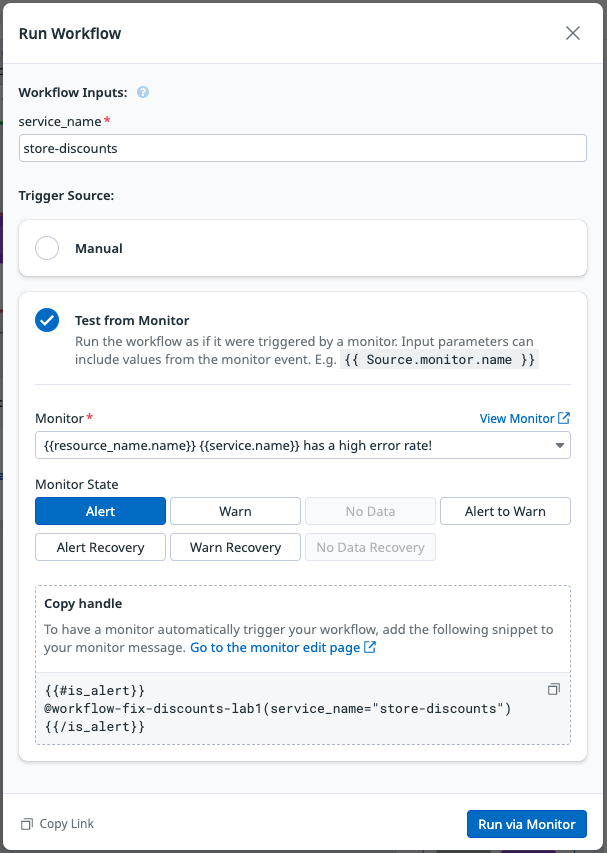
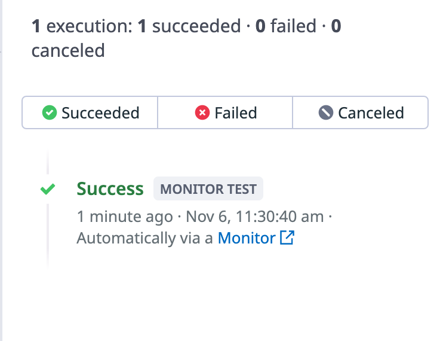
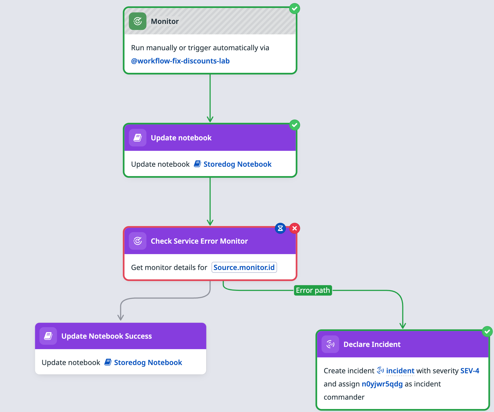
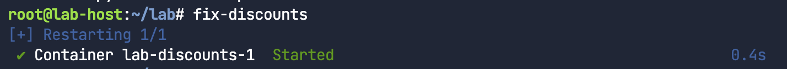
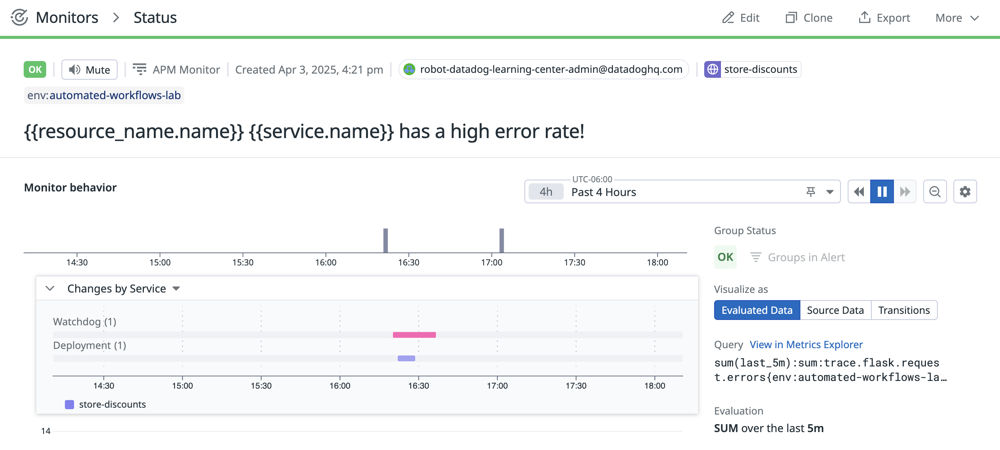
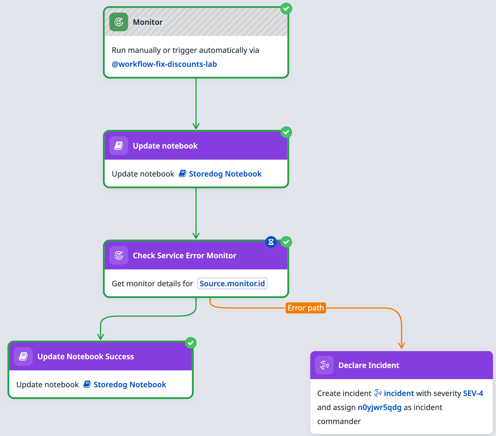
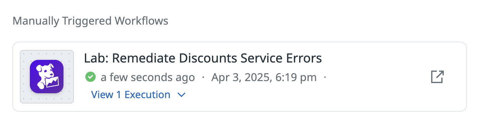
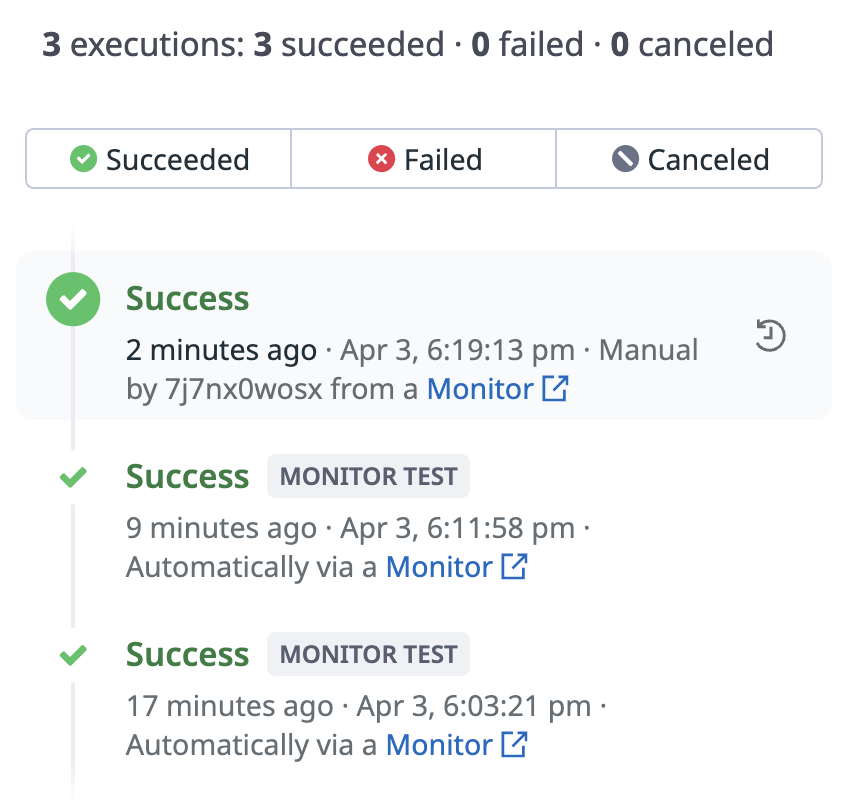

It's time to take the entire workflow for a test run before you publish it! 

You're going to run two tests: one test for the error path and one test for the success path.

In the "real-world" scenario with the autoremediation CI/CD tool action before the monitor health check action, you would also run the two tests: one test for the error path with a deployment that doesn't fix the issue and one test for the success path with a deployment that fixes the issue. 

Here, you'll manually run a command to implement a fix before you test the success path.

In this activity, you'll do the following:

1. Test the workflow error path.
1. Test the workflow success path.
1. Publish the workflow!

Test the workflow error path
===

You'll first check that the monitor is in the ALERT state. Then, you'll test the workflow.

1. In your monitor brower tab, confirm that the monitor is still in an alert status (indicated by a red border, and an `ALERT` badge in the upper-left corner).

    > [!NOTE]
    > If your monitor is not showing an alert status, it's likely because your lab environment has timed out. Restart the lab and your monitor will return to an alert status.

1. Return to your browser tab containing your workflow. Click anywhere in the gray workspace to view overall workflow settings in the sidebar.

1. Click the green **Run** button in the upper-right corner. A **Run Workflow** modal will appear:

    

1. In the **service_name** field, input the name of the Discounts service:

    ```copy
    store-discounts
    ```

1. Under **Trigger Source**, select **Test from Monitor**. From the resulting menu, select your **{{resource_name.name}} {{service.name}} has a high error rate!** monitor. 

    

1. Click the **Run via Monitor** button in the bottom right. 

    Because you just confirmed your monitor is in an ALERT state, the workflow run should follow the error path. 

1. As the workflow test runs, a workflow history will appear on the right. In the primary workflow workspace, the currently executing action will have a blue timer icon. When an action completes successfully, its border will turn green and display a check mark.

    In the Workflow's test history, your monitor test should have a green **Success** label after it completes.

    

1. Click this **Success** entry in the workflow history sidebar to see the path taken through the workflow, indicated in green:

    

    You can go to Incident Management and find the incident that was created.

As you can see, the monitor was still in an ALERT state when you triggered the workflow run. The workflow took the error path and declared an incident. 

Test the success path
===

Now it's time to test the success path. To simulate a successful remediation, you'll manually fix the underlying issue triggering the monitor and rerun the workflow.

1. In the lab terminal, run the command below:

    ```bash,run
    fix-discounts
    ```

    You'll see confirmation that the container has restarted.

    

    Example output:

    ```nocopy
    [+] Restarting 1/1
    ✔ Container lab-discounts-1  Started  
    ```

1. Return to the browser tab open to the Monitor Status page, wait for the monitor to return to an `OK` status.

    > [!NOTE]
    > It may take up to five minutes for the monitor to return to `OK` status. You will likely see the monitor change to `WARN` status before reaching `OK`.

    

1. After the monitor status returns to `OK`, go to the browser tab containing your workflow.
    
1. Click the **Run** button again. 
    
1. Insert `store-discounts` into the **service_name** field.

    ```
    store-discounts
    ```

1. Click **Run via Monitor**. 

    > [!NOTE]
    > You may need to refresh the page to see the second workflow run in progress.

1. After the run completes, browse the workflow history on the right to see the **Success** entry for this test. Click this result to view the success route through the workflow:

    

Great! You've confirmed that both workflow paths execute successfully. 

Publish the workflow
===

It's time to publish your workflow! 

1. In the top right above the sidebar, click **Publish**. A **Confirm access before publishing** modal will appear.

    In the "real-world" scenario, you'd select the team that will oversee this workflow. However, for the purposes of this lab, you'll select yourself.
    
1. Confirm the **Only me** option is selected, and click **Publish**.

1. Navigate to **[Actions > Workflow Automation](https://app.datadoghq.com/workflow)** Your new workflow is now viewable in the list of available workflows. 

1. Return to the browser tab containing the monitor status page.

1. Under **Event timeline** select any event.

1. Under **Next Steps**, click **Run Workflow**. 

1. In the modal that opens, select the workflow you created.

1. Under `service_name` enter `store-discounts`.

    >![Note]
    > When your workflow is automatically triggered from your monitor (as it was in your previous two runs), the alert message automatically provides the `service_name` parameter. If the workflow is triggered manually, the `service_name` parameter will need to be provided manually. In the future, you could set `store-discounts` as the default value for `service_name`.

1. Click **Run**. 

1. Find the **Manually Triggered Workflows** heading, you'll see the new workflow run.

    

1. In the browser tab containing the workflow, you'll also see this workflow run listed in the workflow's sidebar.

    

Lab summary
==============

Congratulations! You've successfully constructed a workflow to remediate errors whenever the Discounts service is performing poorly. 

To build the workflow in this lab, you did the following: 

1. Reviewed the list of components that you'll add to the workflow
1. Confirmed that the app is online in the lab environment 
1. Configured the monitor to act as the trigger in the workflow
1. Created the workflow and add the monitor trigger action
1. Added an input parameter to the workflow
1. Configure the **Update notebook** action
1. Tested the configured **Update notebook** action
1. Reviewed the **Trigger github actions workflow run** action, as an example CI/CD tool remediation action
1. Added a **Get monitor** action to check the monitor state after remediation
1. Added an **Update notebook** action to add the current monitor state if remediation was successful
1. Added an **Open an incident** action for the error path if remediation is not successful
1. Tested the workflow error path.
1. Tested the workflow success path.
1. Published the workflow!

Click **Next** below to complete this lab activity, then click the purple **MARK LESSON COMPLETE & CONTINUE** button at the bottom of the page. Great work! 
